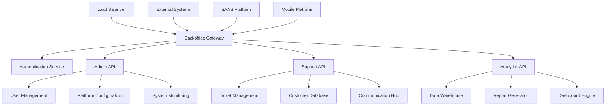

# Backoffice Platform Documentation

  

Welcome to the Backoffice Platform documentation. This section covers our comprehensive administrative and management system for internal operations and client support.

## Overview

The Backoffice Platform is a powerful administrative interface designed to manage all aspects of the Optim ecosystem. It provides centralized control, monitoring, and management capabilities for operations teams, customer support, and system administrators.

## Key Features

- **Multi-Platform Management**: Unified control across all Optim products
- **Customer Support Tools**: Comprehensive support ticket and user management
- **Analytics & Reporting**: Advanced insights and business intelligence
- **System Administration**: Platform configuration and maintenance
- **Audit & Compliance**: Complete activity tracking and compliance reporting
- **Role-Based Access**: Granular permissions and access control

## Quick Links

- **[Getting Started](getting-started.md)** - Setup and onboarding guide
- **[User Guide](user-guide.md)** - End-user documentation
- **[Admin Guide](admin-guide.md)** - Administrative features
- **[Development Guide](development.md)** - Developer documentation
- **[API Reference](api/index.md)** - Complete API documentation
- **[Support Tools](support-tools.md)** - Customer support features
- **[Changelog](changelog.md)** - Version history and updates

## Architecture



## Core Modules

### 🎯 Dashboard & Analytics

- **Executive Dashboard**: High-level KPIs and business metrics
- **Operations Dashboard**: System health and performance monitoring
- **Custom Dashboards**: Role-specific views and widgets
- **Real-time Monitoring**: Live system status and alerts

### 👥 User & Customer Management

- **Customer Database**: Complete customer information and history
- **User Administration**: Account management across all platforms
- **Subscription Management**: Billing, plans, and usage tracking
- **Access Control**: Permissions and role management

### 🎧 Support & Helpdesk

- **Ticket Management**: Comprehensive support ticket system
- **Knowledge Base**: Internal documentation and procedures
- **Communication Tools**: Email, chat, and notification systems
- **SLA Tracking**: Service level agreement monitoring

### 🔧 System Administration

- **Platform Configuration**: System-wide settings and parameters
- **Feature Flags**: A/B testing and feature rollout control
- **Maintenance Tools**: System updates and maintenance scheduling
- **Integration Management**: Third-party service configurations

### 📊 Reporting & Analytics

- **Business Intelligence**: Advanced analytics and insights
- **Custom Reports**: Drag-and-drop report builder
- **Automated Reporting**: Scheduled report generation and delivery
- **Data Export**: Multiple format exports and API access

### 🔍 Audit & Compliance

- **Activity Logging**: Comprehensive audit trails
- **Compliance Reporting**: Regulatory compliance tracking
- **Security Monitoring**: Security events and threat detection
- **Data Governance**: Data handling and privacy controls

## Technology Stack

### **Frontend**

- **React 18** with TypeScript
- **Ant Design** for enterprise UI components
- **Redux Toolkit** for state management
- **React Query** for server state management
- **Recharts** for data visualization

### **Backend**

- **Node.js** with Express.js and TypeScript
- **PostgreSQL** for relational data
- **MongoDB** for document storage
- **Redis** for caching and sessions
- **Elasticsearch** for search and analytics

### **Infrastructure**

- **Docker** containerization
- **Kubernetes** orchestration
- **AWS/GCP** cloud services
- **Terraform** infrastructure as code
- **GitLab CI/CD** for deployment

### **Monitoring & Security**

- **Prometheus/Grafana** for metrics
- **ELK Stack** for centralized logging
- **Auth0** for authentication
- **Vault** for secrets management

## User Roles & Permissions

### **Super Admin**

- Full system access and configuration
- User role management
- Platform-wide settings
- Security and compliance oversight

### **Operations Manager**

- System monitoring and maintenance
- Performance optimization
- Incident response and resolution
- Infrastructure management

### **Customer Success Manager**

- Customer account management
- Subscription and billing oversight
- Success metrics and retention
- Escalation handling

### **Support Agent**

- Ticket management and resolution
- Customer communication
- Knowledge base access
- Basic user account assistance

### **Analytics Specialist**

- Report creation and management
- Data analysis and insights
- Dashboard configuration
- Business intelligence tools

### **Compliance Officer**

- Audit trail access
- Compliance reporting
- Data governance oversight
- Security policy enforcement

## Key Features

### 📈 Advanced Analytics

```typescript
// Analytics capabilities
interface AnalyticsEngine {
  customMetrics: MetricDefinition[];
  realTimeData: StreamingData;
  predictiveAnalytics: MLModels;
  reportScheduler: ScheduledReports;
}
```

### 🎫 Support Ticket System

- **Multi-channel Support**: Email, chat, phone integration
- **Automated Routing**: Intelligent ticket assignment
- **SLA Management**: Response time tracking and escalation
- **Knowledge Integration**: Contextual help and suggestions

### 🔐 Security & Audit

- **Complete Audit Trail**: Every action logged and traceable
- **Role-based Security**: Granular permission system
- **Data Encryption**: End-to-end encryption for sensitive data
- **Compliance Tools**: GDPR, SOC2, HIPAA compliance features

### 🚀 Performance Monitoring

- **Real-time Metrics**: System performance and health
- **Alerting System**: Proactive issue detection
- **Capacity Planning**: Resource usage and scaling insights
- **Performance Analytics**: Trend analysis and optimization

## Integration Capabilities

### **Internal Platforms**

- **SAAS Platform**: Direct management and monitoring
- **Mobile Platform**: App management and analytics
- **Commands Platform**: Tool administration and logs

### **External Services**

- **CRM Systems**: Salesforce, HubSpot integration
- **Communication**: Slack, Teams, email providers
- **Analytics**: Google Analytics, Mixpanel
- **Billing**: Stripe, PayPal, enterprise billing systems

### **APIs & Webhooks**

- **RESTful APIs**: Comprehensive API coverage
- **GraphQL**: Flexible data querying
- **Webhooks**: Real-time event notifications
- **Bulk Operations**: Batch processing capabilities

## Getting Started

### For Administrators

1. **Access Setup**: Obtain admin credentials and 2FA setup
2. **Role Configuration**: Set up user roles and permissions
3. **Dashboard Setup**: Configure monitoring dashboards
4. **Integration Config**: Connect external systems and APIs

### For Support Staff

1. **Account Access**: Get support role credentials
2. **Ticket Training**: Learn ticket management workflows
3. **Knowledge Base**: Familiarize with support documentation
4. **Communication Tools**: Set up chat and email integration

### For Analytics Users

1. **Data Access**: Obtain analytics role permissions
2. **Dashboard Config**: Set up custom dashboards
3. **Report Builder**: Learn report creation tools
4. **Data Export**: Configure automated reports

## Service Levels

### **Standard Features**

- Basic dashboard and monitoring
- Standard reporting capabilities
- Email support integration
- Basic user management

### **Professional Features**

- Advanced analytics and insights
- Custom dashboard creation
- Multi-channel support integration
- API access and automation

### **Enterprise Features**

- White-label customization
- Advanced security features
- Custom integrations
- Dedicated support and training

## Security & Compliance

### **Security Features**

- **Multi-factor Authentication**: TOTP, SMS, hardware keys
- **Session Management**: Secure session handling and timeout
- **IP Restrictions**: Whitelist-based access control
- **Audit Logging**: Comprehensive activity tracking

### **Compliance Standards**

- **SOC 2 Type II** compliance
- **GDPR** data protection compliance
- **HIPAA** healthcare data security
- **ISO 27001** security management

### **Data Protection**

- **Encryption**: AES-256 encryption at rest and in transit
- **Data Backup**: Automated backup and recovery
- **Access Controls**: Principle of least privilege
- **Data Retention**: Configurable retention policies

## Performance & Scalability

### **Performance Metrics**

- **Response Time**: <200ms average API response
- **Uptime**: 99.9% availability SLA
- **Concurrent Users**: Support for 1000+ concurrent sessions
- **Data Processing**: Real-time analytics on large datasets

### **Scalability Features**

- **Horizontal Scaling**: Auto-scaling based on load
- **Caching Strategy**: Multi-layer caching for performance
- **Database Optimization**: Query optimization and indexing
- **CDN Integration**: Global content delivery

## Support & Resources

### **Documentation**

- **[User Manual](user-guide.md)** - Complete user guide
- **[Admin Guide](admin-guide.md)** - Administrative procedures
- **[API Documentation](api/index.md)** - Complete API reference
- **[Troubleshooting](troubleshooting.md)** - Common issues and solutions

### **Training Resources**

- **Video Tutorials**: Step-by-step feature walkthroughs
- **Live Training**: Regular training sessions for new features
- **Documentation**: Comprehensive guides and procedures
- **Best Practices**: Optimization and efficiency guides

### **Support Channels**

- **Help Desk**: Internal support ticket system
- **Live Chat**: Real-time support during business hours
- **Email Support**: backoffice-support@optim.com
- **Emergency Line**: 24/7 for critical system issues

## Roadmap

### **Q4 2025**

- Enhanced mobile app for field support
- AI-powered ticket routing and insights
- Advanced automation workflows
- Improved integration marketplace

### **Q1 2026**

- Machine learning analytics
- Predictive maintenance alerts
- Enhanced security features
- Multi-tenant dashboard improvements

### **Q2 2026**

- Voice integration for support
- Advanced workflow automation
- Custom app development platform
- Enhanced reporting capabilities

## Best Practices

### **Administration**

- **Regular Backups**: Automated daily backups with testing
- **Security Reviews**: Monthly security audits and updates
- **Performance Monitoring**: Continuous monitoring and optimization
- **User Training**: Regular training sessions for new features

### **Support Operations**

- **SLA Adherence**: Monitor and maintain response times
- **Knowledge Management**: Keep documentation current
- **Escalation Procedures**: Clear escalation paths and procedures
- **Customer Communication**: Proactive communication and updates

### **Data Management**

- **Data Quality**: Regular data validation and cleanup
- **Access Controls**: Regular review of user permissions
- **Backup Testing**: Regular backup recovery testing
- **Compliance Audits**: Regular compliance reviews and updates

## Contributing

### **Feature Requests**

- Submit requests through internal portal
- Provide detailed use cases and requirements
- Participate in feature review sessions
- Test beta features and provide feedback

### **Bug Reports**

- Use internal bug tracking system
- Provide detailed reproduction steps
- Include screenshots and system information
- Work with development team on resolution

### **Documentation**

- Contribute to knowledge base
- Update procedures and workflows
- Create training materials
- Review and improve existing documentation

---

_Project maintained by the Backoffice Platform Team | For support: backoffice-team@optim.com_
