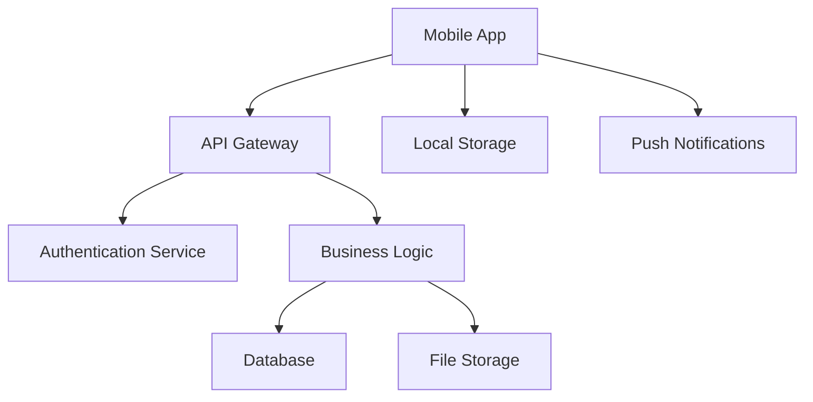

# Mobile Platform Documentation

 

Welcome to the Mobile Platform documentation. This section covers our cross-platform mobile application suite.

## Overview

The Mobile Platform provides a unified mobile experience across iOS and Android devices, featuring:

- Cross-platform compatibility
- Native performance optimization
- Secure authentication and data handling
- Offline-first architecture
- Real-time synchronization

## Quick Links

- **[Getting Started](getting-started.md)** - Setup and installation guide
- **[Development Guide](development.md)** - Developer documentation
- **[User Manual](user-guide.md)** - End-user instructions
- **[API Reference](api/index.md)** - Technical API documentation
- **[Deployment](deployment/index.md)** - Deployment and operations
- **[Changelog](changelog.md)** - Version history

## Architecture

## Key Features

### 🔐 Security

- End-to-end encryption
- Biometric authentication
- Secure token management

### 📱 Cross-Platform

- React Native framework
- Shared business logic
- Platform-specific optimizations

### 🔄 Synchronization

- Real-time data sync
- Offline capability
- Conflict resolution

### 📊 Analytics

- Usage tracking
- Performance monitoring
- Error reporting

## Support

For mobile platform support:

- Check the [troubleshooting guide](troubleshooting.md)
- Review [known issues](known-issues.md)
- Contact the mobile team

---

_Project maintained by the Mobile Development Team_
