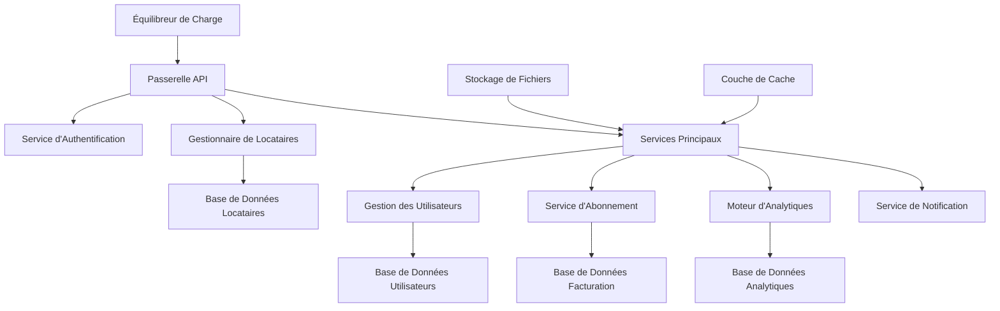

# Documentation de la Plateforme SAAS

  

Bienvenue dans la documentation de la Plateforme SAAS. Cette section couvre notre solution Software-as-a-Service qui fournit des services multi-locataires évolutifs à nos clients.

## Aperçu

La Plateforme SAAS est une solution multi-locataire complète conçue pour fournir des services logiciels évolutifs aux entreprises de toutes tailles. Elle comprend :

- **Multi-location** : Isolation sécurisée des locataires et ségrégation des données
- **Architecture Évolutive** : Mise à l'échelle automatique selon la demande
- **Gestion des Abonnements** : Modèles de facturation et d'abonnement flexibles
- **Conception API-First** : APIs RESTful avec documentation complète
- **Analytiques en Temps Réel** : Rapports avancés et insights
- **Hub d'Intégration** : Intégrations de services tiers

## Liens Rapides

- **[Premiers Pas](getting-started.md)** - Guide de configuration et d'intégration
- **[Guide Utilisateur](user-guide.md)** - Documentation utilisateur final
- **[Guide Administrateur](admin-guide.md)** - Fonctionnalités administratives
- **[Guide de Développement](development.md)** - Documentation développeur
- **[Référence API](api/index.md)** - Documentation API complète
- **[Déploiement](deployment/index.md)** - Déploiement et opérations
- **[Journal des Modifications](changelog.md)** - Historique des versions et mises à jour

## Architecture

## Fonctionnalités Clés

### 🏢 Architecture Multi-Locataire

- **Isolation des Locataires** : Séparation complète des données et ressources
- **Image de Marque Personnalisée** : Solutions en marque blanche pour les clients entreprise
- **Gestion des Ressources** : Attribution et limites de ressources par locataire
- **Sécurité** : Sécurité avancée avec contrôles d'accès au niveau locataire

### 💳 Gestion des Abonnements

- **Plans Flexibles** : Plusieurs niveaux d'abonnement et plans personnalisés
- **Suivi d'Utilisation** : Surveillance et facturation de l'utilisation en temps réel
- **Intégration de Paiement** : Stripe, PayPal et facturation entreprise
- **Gestion des Essais** : Essais gratuits et workflows de mise à niveau

### 📊 Analytiques et Rapports

- **Tableaux de Bord Temps Réel** : Métriques et KPI en direct
- **Rapports Personnalisés** : Capacités de rapports spécifiques aux locataires
- **Export de Données** : Exports de données CSV, PDF et API
- **Analytiques d'Utilisation** : Modèles d'utilisation détaillés et insights

### 🔌 Écosystème d'Intégration

- **APIs REST** : Couverture API complète
- **Webhooks** : Notifications d'événements en temps réel
- **Intégrations Tierces** : Outils CRM, ERP et de productivité
- **Support SSO** : SAML, OAuth et Active Directory

### 🚀 Performance et Évolutivité

- **Mise à l'Échelle Automatique** : Mise à l'échelle horizontale et verticale
- **Intégration CDN** : Livraison de contenu globale
- **Stratégie de Cache** : Cache multi-niveaux pour performance optimale
- **Équilibrage de Charge** : Distribution intelligente du trafic

## Stack Technologique

### **Frontend**

- **React 18** avec TypeScript
- **Material-UI** pour un design cohérent
- **Redux Toolkit** pour la gestion d'état
- **React Query** pour la récupération de données

### **Backend**

- **Node.js** avec Express.js
- **TypeScript** pour la sécurité des types
- **PostgreSQL** avec schéma multi-locataire
- **Redis** pour le cache et les sessions

### **Infrastructure**

- **Docker** containerisation
- **Kubernetes** orchestration
- **AWS/GCP** fournisseurs cloud
- **Terraform** pour l'infrastructure en tant que code

### **Surveillance et Sécurité**

- **Prometheus/Grafana** pour la surveillance
- **Stack ELK** pour les logs
- **Auth0** pour l'authentification
- **Vault** pour la gestion des secrets

## Premiers Pas

### Pour les Utilisateurs Finaux

1. **Configuration du Compte** : Inscrivez-vous ou recevez une invitation de l'administrateur
2. **Sélection de Locataire** : Choisissez ou créez votre espace de travail
3. **Configuration du Profil** : Configurez votre profil utilisateur et préférences
4. **Visite des Fonctionnalités** : Explorez la plateforme avec des tutoriels guidés

### Pour les Développeurs

1. **Environnement de Développement** : Configurez l'environnement de développement local
2. **Accès API** : Obtenez les clés API et consultez la documentation
3. **Guide d'Intégration** : Suivez les modèles et exemples d'intégration
4. **Tests** : Utilisez l'environnement sandbox pour les tests

### Pour les Administrateurs

1. **Gestion des Locataires** : Créez et configurez les instances de locataires
2. **Administration des Utilisateurs** : Gérez les utilisateurs, rôles et permissions
3. **Configuration des Abonnements** : Configurez la facturation et les plans d'abonnement
4. **Configuration Système** : Paramètres et personnalisations à l'échelle de la plateforme

## Niveaux de Service

### **Plan Débutant**

- Jusqu'à 10 utilisateurs
- Fonctionnalités de base
- Support par email
- SLA de disponibilité 99.5%

### **Plan Professionnel**

- Jusqu'à 100 utilisateurs
- Fonctionnalités avancées
- Support prioritaire
- SLA de disponibilité 99.9%

### **Plan Entreprise**

- Utilisateurs illimités
- Fonctionnalités personnalisées
- Support dédié
- SLA de disponibilité 99.99%
- Intégrations personnalisées

## Sécurité et Conformité

### **Fonctionnalités de Sécurité**

- **Chiffrement de Bout en Bout** : Chiffrement des données en transit et au repos
- **Authentification Multi-Facteurs** : 2FA basé sur TOTP et SMS
- **Contrôle d'Accès Basé sur les Rôles** : Gestion granulaire des permissions
- **Journalisation d'Audit** : Journalisation complète des activités

### **Standards de Conformité**

- Certifié **SOC 2 Type II**
- Traitement des données conforme **RGPD**
- Prêt **HIPAA** pour les locataires de santé
- Gestion de sécurité **ISO 27001**

## Support et Ressources

### **Documentation**

- **[Manuel Utilisateur](user-guide.md)** - Documentation utilisateur complète
- **[Documentation API](api/index.md)** - Documentation API interactive
- **[Guide d'Intégration](integrations/index.md)** - Intégrations tierces
- **[Dépannage](troubleshooting.md)** - Problèmes courants et solutions

### **Canaux de Support**

- **Centre d'Aide** - Base de connaissances en libre-service
- **Chat en Direct** - Support en temps réel pendant les heures ouvrables
- **Support Email** - support@optim.com
- **Support Téléphonique** - Disponible pour les plans Entreprise

### **Communauté**

- **Forum Développeur** - Discussions communautaires et Q&R
- **Canal Slack** - Chat développeur en temps réel
- **Webinaires** - Mises à jour produit et formations régulières
- **Groupes d'Utilisateurs** - Rencontres locales et virtuelles

## Feuille de Route

### **Q4 2025**

- Tableau de bord analytiques avancé
- Application mobile compagnon
- Limitation de taux API améliorée
- Nouveaux partenariats d'intégration

### **Q1 2026**

- Insights alimentés par IA
- Automatisation de workflow avancée
- Déploiement multi-région
- Fonctionnalités de sécurité améliorées

### **Q2 2026**

- Support de domaine personnalisé
- Constructeur de rapports avancé
- Intégrations marketplace
- Optimisations de performance

## Contribution

Nous accueillons les contributions de notre communauté :

1. **Rapports de Bugs** - Soumettez les problèmes via GitHub
2. **Demandes de Fonctionnalités** - Proposez de nouvelles fonctionnalités
3. **Documentation** - Aidez à améliorer notre documentation
4. **Contributions de Code** - Soumettez des pull requests

Pour des directives de contribution détaillées, consultez notre [Guide de Contribution](contributing.md).

---

_Projet maintenu par l'Équipe Plateforme SAAS | Pour le support : saas-team@optim.com_
