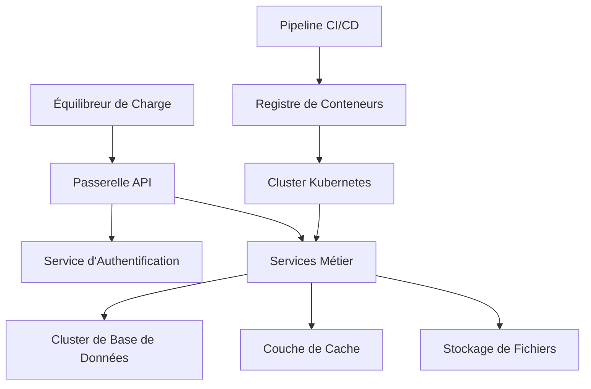

# Documentation Infrastructure

Cette section couvre la configuration de l'infrastructure, les processus de déploiement et les procédures opérationnelles pour tous les projets Optim.

## Aperçu

Notre infrastructure est conçue pour l'évolutivité, la fiabilité et la sécurité dans plusieurs environnements.

## Stratégie d'Environnement

### Types d'Environnements

| Environnement     | Objectif                     | Accès                     | Déploiement                  |
| ----------------- | ---------------------------- | ------------------------- | ---------------------------- |
| **Développement** | Développement local et tests | Tous les développeurs     | Manuel/automatique           |
| **Recette**       | Tests de pré-production      | Consultants, développeurs | Manuel                       |
| **Production**    | Système en direct            | Distributeurs, clients    | Approbation manuelle requise |

### Configuration des Environnements

```yaml
# environments.yml
development:
  api_url: "http://localhost:3000"
  database_url: "postgres://localhost:5432/optim_dev"
  redis_url: "redis://localhost:6379"
  log_level: "debug"

staging:
  api_url: "https://staging-api.optim.com"
  database_url: "${STAGING_DATABASE_URL}"
  redis_url: "${STAGING_REDIS_URL}"
  log_level: "info"

production:
  api_url: "https://api.optim.com"
  database_url: "${PRODUCTION_DATABASE_URL}"
  redis_url: "${PRODUCTION_REDIS_URL}"
  log_level: "warn"
```

## Architecture de Déploiement

### Architecture de Haut Niveau



### Stack Technologique

**Orchestration de Conteneurs**

- Kubernetes (EKS/GKE)
- Conteneurs Docker
- Charts Helm pour le déploiement

**Bases de Données**

- PostgreSQL (base de données principale)
- Redis (cache et sessions)
- MongoDB (stockage de documents)

**Infrastructure**

- Fournisseurs cloud AWS/GCP
- Terraform pour l'infrastructure en tant que code
- CDN pour les ressources statiques

**Surveillance et Journalisation**

- Prometheus/Grafana pour les métriques
- Stack ELK pour la journalisation
- Sentry pour le suivi des erreurs

## Processus de Déploiement

### Pipeline CI/CD

```yaml
# .github/workflows/deploy.yml
name: Déployer
on:
  push:
    branches: [main, develop]
  pull_request:
    branches: [main]

jobs:
  test:
    runs-on: ubuntu-latest
    steps:
      - uses: actions/checkout@v3
      - name: Exécuter les tests
        run: |
          npm ci
          npm run test:coverage
          npm run lint

  build:
    needs: test
    runs-on: ubuntu-latest
    steps:
      - uses: actions/checkout@v3
      - name: Construire l'image Docker
        run: |
          docker build -t optim/app:${{ github.sha }} .
          docker push optim/app:${{ github.sha }}

  deploy-staging:
    needs: build
    if: github.ref == 'refs/heads/develop'
    runs-on: ubuntu-latest
    steps:
      - name: Déployer en staging
        run: |
          helm upgrade --install optim-app ./helm/optim-app \
            --set image.tag=${{ github.sha }} \
            --namespace staging

  deploy-production:
    needs: build
    if: github.ref == 'refs/heads/main'
    runs-on: ubuntu-latest
    environment: production
    steps:
      - name: Déployer en production
        run: |
          helm upgrade --install optim-app ./helm/optim-app \
            --set image.tag=${{ github.sha }} \
            --namespace production
```

### Étapes de Déploiement

1. **Fusion de Code** - Code fusionné vers la branche main/develop
2. **Tests Automatisés** - Tests unitaires et d'intégration exécutés
3. **Processus de Build** - Images Docker construites et étiquetées
4. **Scan de Sécurité** - Images de conteneurs scannées pour les vulnérabilités
5. **Déploiement Staging** - Déploiement automatique vers staging
6. **Approbation Production** - Approbation manuelle pour le déploiement en production
7. **Déploiement Production** - Déploiement avec stratégie blue-green
8. **Vérifications de Santé** - Vérification automatique de la santé
9. **Rollback** - Rollback automatique en cas d'échec

### Stratégie de Rollback

```bash
# Rollback rapide vers la version précédente
kubectl rollout undo deployment/optim-app -n production

# Rollback vers une révision spécifique
kubectl rollout undo deployment/optim-app --to-revision=3 -n production

# Vérifier le statut du rollout
kubectl rollout status deployment/optim-app -n production
```

## Infrastructure en tant que Code

### Configuration Terraform

```hcl
# main.tf
provider "aws" {
  region = var.aws_region
}

module "eks_cluster" {
  source = "./modules/eks"

  cluster_name = "optim-cluster"
  node_groups = {
    main = {
      instance_types = ["t3.medium"]
      min_size       = 2
      max_size       = 10
      desired_size   = 3
    }
  }
}

module "rds_database" {
  source = "./modules/rds"

  engine         = "postgres"
  engine_version = "13.7"
  instance_class = "db.t3.micro"
  allocated_storage = 20
}

module "elasticache" {
  source = "./modules/elasticache"

  engine           = "redis"
  node_type        = "cache.t3.micro"
  num_cache_nodes  = 1
}
```

### Manifestes Kubernetes

```yaml
# k8s/deployment.yml
apiVersion: apps/v1
kind: Deployment
metadata:
  name: optim-app
  namespace: production
spec:
  replicas: 3
  selector:
    matchLabels:
      app: optim-app
  template:
    metadata:
      labels:
        app: optim-app
    spec:
      containers:
        - name: app
          image: optim/app:latest
          ports:
            - containerPort: 3000
          env:
            - name: DATABASE_URL
              valueFrom:
                secretKeyRef:
                  name: database-secret
                  key: url
          resources:
            requests:
              memory: "256Mi"
              cpu: "250m"
            limits:
              memory: "512Mi"
              cpu: "500m"
          livenessProbe:
            httpGet:
              path: /health
              port: 3000
            initialDelaySeconds: 30
            periodSeconds: 10
          readinessProbe:
            httpGet:
              path: /ready
              port: 3000
            initialDelaySeconds: 5
            periodSeconds: 5
```

## Surveillance et Alertes

### Collecte de Métriques

```yaml
# prometheus/config.yml
global:
  scrape_interval: 15s

scrape_configs:
  - job_name: "optim-app"
    kubernetes_sd_configs:
      - role: pod
    relabel_configs:
      - source_labels: [__meta_kubernetes_pod_annotation_prometheus_io_scrape]
        action: keep
        regex: true
```

### Règles d'Alerte

```yaml
# alerts/app.yml
groups:
  - name: optim-app
    rules:
      - alert: TauxErreurEleve
        expr: rate(http_requests_total{status=~"5.."}[5m]) > 0.1
        for: 5m
        labels:
          severity: warning
        annotations:
          summary: "Taux d'erreur élevé détecté"
          description: "Le taux d'erreur est de {{ $value }} erreurs par seconde"

      - alert: UtilisationMemoireElevee
        expr: container_memory_usage_bytes / container_spec_memory_limit_bytes > 0.9
        for: 2m
        labels:
          severity: critical
        annotations:
          summary: "Utilisation mémoire élevée"
          description: "L'utilisation mémoire est supérieure à 90%"
```

### Tableaux de Bord

```json
{
  "dashboard": {
    "title": "Métriques Application Optim",
    "panels": [
      {
        "title": "Taux de Requêtes",
        "type": "graph",
        "targets": [
          {
            "expr": "rate(http_requests_total[5m])",
            "legendFormat": "{{method}} {{status}}"
          }
        ]
      },
      {
        "title": "Temps de Réponse",
        "type": "graph",
        "targets": [
          {
            "expr": "histogram_quantile(0.95, rate(http_request_duration_seconds_bucket[5m]))",
            "legendFormat": "95e percentile"
          }
        ]
      }
    ]
  }
}
```

## Sécurité

### Sécurité Réseau

```yaml
# k8s/network-policy.yml
apiVersion: networking.k8s.io/v1
kind: NetworkPolicy
metadata:
  name: optim-app-policy
  namespace: production
spec:
  podSelector:
    matchLabels:
      app: optim-app
  policyTypes:
    - Ingress
    - Egress
  ingress:
    - from:
        - podSelector:
            matchLabels:
              app: nginx-ingress
      ports:
        - protocol: TCP
          port: 3000
  egress:
    - to:
        - podSelector:
            matchLabels:
              app: postgres
      ports:
        - protocol: TCP
          port: 5432
```

### Gestion des Secrets

```yaml
# k8s/secrets.yml
apiVersion: v1
kind: Secret
metadata:
  name: database-secret
  namespace: production
type: Opaque
data:
  url: <url-base-de-donnees-encodee-base64>
  password: <mot-de-passe-encode-base64>
```

### Configuration SSL/TLS

```yaml
# k8s/ingress.yml
apiVersion: networking.k8s.io/v1
kind: Ingress
metadata:
  name: optim-app-ingress
  annotations:
    cert-manager.io/cluster-issuer: letsencrypt-prod
    nginx.ingress.kubernetes.io/ssl-redirect: "true"
spec:
  tls:
    - hosts:
        - api.optim.com
      secretName: optim-tls
  rules:
    - host: api.optim.com
      http:
        paths:
          - path: /
            pathType: Prefix
            backend:
              service:
                name: optim-app-service
                port:
                  number: 80
```

## Sauvegarde et Reprise après Sinistre

### Sauvegardes de Base de Données

```bash
#!/bin/bash
# scripts/backup-database.sh

# Sauvegarde quotidienne
pg_dump $DATABASE_URL | gzip > backups/$(date +%Y%m%d)-database.sql.gz

# Upload vers S3
aws s3 cp backups/$(date +%Y%m%d)-database.sql.gz s3://optim-backups/database/

# Nettoyage des anciennes sauvegardes (conserver 30 jours)
find backups/ -name "*.sql.gz" -mtime +30 -delete
```

### Plan de Reprise après Sinistre

1. **RTO (Objectif de Temps de Récupération)** : 4 heures
2. **RPO (Objectif de Point de Récupération)** : 1 heure
3. **Stratégie de Sauvegarde** : Sauvegardes quotidiennes de base de données, réplication de fichiers en temps réel
4. **Processus de Basculement** : Basculement DNS automatique vers la région secondaire

## Optimisation des Performances

### Stratégies de Mise à l'Échelle

```yaml
# k8s/hpa.yml
apiVersion: autoscaling/v2
kind: HorizontalPodAutoscaler
metadata:
  name: optim-app-hpa
spec:
  scaleTargetRef:
    apiVersion: apps/v1
    kind: Deployment
    name: optim-app
  minReplicas: 3
  maxReplicas: 20
  metrics:
    - type: Resource
      resource:
        name: cpu
        target:
          type: Utilization
          averageUtilization: 70
    - type: Resource
      resource:
        name: memory
        target:
          type: Utilization
          averageUtilization: 80
```

### Stratégie de Cache

```yaml
# Configuration Redis
apiVersion: v1
kind: ConfigMap
metadata:
  name: redis-config
data:
  redis.conf: |
    maxmemory 256mb
    maxmemory-policy allkeys-lru
    save 900 1
    save 300 10
    save 60 10000
```

## Snippets de Code pour Tâches Récurrentes

Cette section contient des extraits de code réutilisables pour les tâches d'infrastructure courantes et répétitives.

### Gestion des Deployments Kubernetes

#### Déploiement Rapide d'une Nouvelle Version

```bash
#!/bin/bash
# Déploiement rapide avec vérification de santé
APP_NAME=${1:-optim-app}
NAMESPACE=${2:-production}
IMAGE_TAG=${3:-latest}

echo "🚀 Déploiement de $APP_NAME:$IMAGE_TAG vers $NAMESPACE..."

# Mise à jour de l'image
kubectl set image deployment/$APP_NAME app=optim/$APP_NAME:$IMAGE_TAG -n $NAMESPACE

# Attendre que le rollout soit terminé
kubectl rollout status deployment/$APP_NAME -n $NAMESPACE --timeout=300s

# Vérifier la santé des pods
kubectl get pods -l app=$APP_NAME -n $NAMESPACE
```

#### Redimensionnement Rapide d'Application

```bash
#!/bin/bash
# Script de redimensionnement rapide
APP_NAME=${1:-optim-app}
REPLICAS=${2:-3}
NAMESPACE=${3:-production}

echo "📊 Redimensionnement de $APP_NAME à $REPLICAS répliques..."

kubectl scale deployment $APP_NAME --replicas=$REPLICAS -n $NAMESPACE
kubectl rollout status deployment/$APP_NAME -n $NAMESPACE
```

#### Redémarrage Forcé de Pods

```bash
#!/bin/bash
# Redémarrage complet des pods d'une application
APP_NAME=${1:-optim-app}
NAMESPACE=${2:-production}

echo "🔄 Redémarrage forcé de $APP_NAME..."

kubectl rollout restart deployment/$APP_NAME -n $NAMESPACE
kubectl rollout status deployment/$APP_NAME -n $NAMESPACE
```

### Gestion des Bases de Données

#### Sauvegarde Complète de Base de Données

```bash
#!/bin/bash
# Sauvegarde complète avec métadonnées
DB_NAME=${1:-optim_production}
TIMESTAMP=$(date +%Y%m%d_%H%M%S)
BACKUP_DIR="/backups"

echo "💾 Sauvegarde de $DB_NAME..."

# Créer le répertoire de sauvegarde
mkdir -p $BACKUP_DIR

# Sauvegarde avec compression
pg_dump $DATABASE_URL \
  --verbose \
  --clean \
  --no-acl \
  --no-owner \
  | gzip > $BACKUP_DIR/${DB_NAME}_${TIMESTAMP}.sql.gz

# Vérifier la sauvegarde
if [ $? -eq 0 ]; then
  echo "✅ Sauvegarde réussie: ${DB_NAME}_${TIMESTAMP}.sql.gz"

  # Upload vers S3
  aws s3 cp $BACKUP_DIR/${DB_NAME}_${TIMESTAMP}.sql.gz \
    s3://optim-backups/database/
else
  echo "❌ Échec de la sauvegarde"
  exit 1
fi
```

#### Restauration de Base de Données

```bash
#!/bin/bash
# Restauration sécurisée de base de données
BACKUP_FILE=${1}
TARGET_DB=${2:-optim_staging}

if [ -z "$BACKUP_FILE" ]; then
  echo "❌ Fichier de sauvegarde requis"
  echo "Usage: $0 <backup_file> [target_db]"
  exit 1
fi

echo "⚠️  ATTENTION: Restauration vers $TARGET_DB"
read -p "Êtes-vous sûr? (oui/non): " confirm

if [ "$confirm" = "oui" ]; then
  echo "🔄 Restauration en cours..."

  # Décompresser et restaurer
  gunzip -c $BACKUP_FILE | psql $TARGET_DATABASE_URL

  echo "✅ Restauration terminée"
else
  echo "❌ Restauration annulée"
fi
```

### Monitoring et Logs

#### Collection de Logs d'Urgence

```bash
#!/bin/bash
# Collecte rapide de logs pour debug
APP_NAME=${1:-optim-app}
NAMESPACE=${2:-production}
LINES=${3:-1000}
OUTPUT_DIR="/tmp/logs_$(date +%Y%m%d_%H%M%S)"

echo "📝 Collecte des logs de $APP_NAME..."

mkdir -p $OUTPUT_DIR

# Logs de tous les pods
for pod in $(kubectl get pods -l app=$APP_NAME -n $NAMESPACE -o name); do
  pod_name=$(basename $pod)
  echo "Collecte logs de $pod_name..."

  kubectl logs $pod_name -n $NAMESPACE --tail=$LINES \
    > $OUTPUT_DIR/${pod_name}.log

  # Logs du conteneur précédent si redémarrage
  kubectl logs $pod_name -n $NAMESPACE --previous --tail=$LINES \
    > $OUTPUT_DIR/${pod_name}_previous.log 2>/dev/null || true
done

# Événements Kubernetes
kubectl get events -n $NAMESPACE --sort-by='.lastTimestamp' \
  > $OUTPUT_DIR/k8s_events.log

echo "✅ Logs collectés dans: $OUTPUT_DIR"
tar -czf $OUTPUT_DIR.tar.gz -C /tmp $(basename $OUTPUT_DIR)
echo "📦 Archive créée: $OUTPUT_DIR.tar.gz"
```

#### Vérification de Santé Complète

```bash
#!/bin/bash
# Script de vérification de santé globale
NAMESPACE=${1:-production}

echo "🏥 Vérification de santé globale..."

# Statut des deployments
echo "=== DEPLOYMENTS ==="
kubectl get deployments -n $NAMESPACE -o wide

# Statut des pods
echo -e "\n=== PODS ==="
kubectl get pods -n $NAMESPACE -o wide

# Utilisation des ressources
echo -e "\n=== RESSOURCES ==="
kubectl top pods -n $NAMESPACE --sort-by=memory

# Services et endpoints
echo -e "\n=== SERVICES ==="
kubectl get services -n $NAMESPACE

# Événements récents
echo -e "\n=== ÉVÉNEMENTS RÉCENTS ==="
kubectl get events -n $NAMESPACE --sort-by='.lastTimestamp' | tail -10

# Alertes actives (si Prometheus)
echo -e "\n=== ALERTES ACTIVES ==="
curl -s http://prometheus:9090/api/v1/alerts | jq '.data.alerts[] | select(.state=="firing")' 2>/dev/null || echo "Prometheus non accessible"
```

### Maintenance et Nettoyage

#### Nettoyage d'Images Docker

```bash
#!/bin/bash
# Nettoyage des images Docker obsolètes
KEEP_DAYS=${1:-7}

echo "🧹 Nettoyage des images Docker (conserver $KEEP_DAYS jours)..."

# Supprimer les images non utilisées
docker image prune -a -f --filter "until=${KEEP_DAYS}*24h"

# Supprimer les volumes orphelins
docker volume prune -f

# Supprimer les réseaux inutilisés
docker network prune -f

# Supprimer les conteneurs arrêtés
docker container prune -f

echo "✅ Nettoyage terminé"
docker system df
```

#### Rotation des Secrets Kubernetes

```bash
#!/bin/bash
# Rotation de secret avec zero-downtime
SECRET_NAME=${1}
NAMESPACE=${2:-production}

if [ -z "$SECRET_NAME" ]; then
  echo "❌ Nom du secret requis"
  echo "Usage: $0 <secret_name> [namespace]"
  exit 1
fi

echo "🔐 Rotation du secret $SECRET_NAME..."

# Sauvegarder l'ancien secret
kubectl get secret $SECRET_NAME -n $NAMESPACE -o yaml > /tmp/${SECRET_NAME}_backup.yaml

# Générer nouveau mot de passe
NEW_PASSWORD=$(openssl rand -base64 32)

# Mettre à jour le secret
kubectl create secret generic $SECRET_NAME \
  --from-literal=password=$NEW_PASSWORD \
  --dry-run=client -o yaml | kubectl apply -n $NAMESPACE -f -

# Redémarrer les deployments qui utilisent ce secret
for deployment in $(kubectl get deployments -n $NAMESPACE -o json | jq -r '.items[] | select(.spec.template.spec.containers[].env[]?.valueFrom.secretKeyRef.name=="'$SECRET_NAME'") | .metadata.name'); do
  echo "Redémarrage de $deployment..."
  kubectl rollout restart deployment/$deployment -n $NAMESPACE
done

echo "✅ Rotation du secret terminée"
```

### Scripts d'Automatisation CI/CD

#### Validation Pré-Déploiement

<!-- ```bash
#!/bin/bash
# Validation complète avant déploiement
APP_NAME=${1:-optim-app}
IMAGE_TAG=${2:-latest}

echo "🔍 Validation pré-déploiement pour $APP_NAME:$IMAGE_TAG..."

# 1. Vérifier que l'image existe
if ! docker manifest inspect optim/$APP_NAME:$IMAGE_TAG > /dev/null 2>&1; then
  echo "❌ Image optim/$APP_NAME:$IMAGE_TAG introuvable"
  exit 1
fi

# 2. Scanner la sécurité de l'image
echo "🔒 Scan de sécurité..."
trivy image optim/$APP_NAME:$IMAGE_TAG --severity HIGH,CRITICAL

# 3. Tester la configuration Kubernetes
echo "📋 Validation de la configuration K8s..."
helm template optim-app ./helm/optim-app \
  --set image.tag=$IMAGE_TAG \
  --validate

# 4. Vérifier les ressources disponibles
echo "📊 Vérification des ressources..."
kubectl top nodes

echo "✅ Validation terminée avec succès"
``` -->

#### Post-Déploiement Health Check

<!-- ```bash
#!/bin/bash
# Vérifications post-déploiement
APP_NAME=${1:-optim-app}
NAMESPACE=${2:-production}
HEALTH_ENDPOINT=${3:-/health}

echo "🩺 Vérifications post-déploiement..."

# Attendre que tous les pods soient prêts
kubectl wait --for=condition=ready pod -l app=$APP_NAME -n $NAMESPACE --timeout=300s

# Obtenir l'URL du service
SERVICE_URL=$(kubectl get service $APP_NAME-service -n $NAMESPACE -o jsonpath='{.status.loadBalancer.ingress[0].hostname}' 2>/dev/null)

if [ -z "$SERVICE_URL" ]; then
  # Fallback: port-forward temporaire
  kubectl port-forward service/$APP_NAME-service 8080:80 -n $NAMESPACE &
  PF_PID=$!
  SERVICE_URL="localhost:8080"
  sleep 5
fi

# Test de l'endpoint de santé
echo "🔗 Test de l'endpoint: http://$SERVICE_URL$HEALTH_ENDPOINT"
for i in {1..5}; do
  if curl -sf http://$SERVICE_URL$HEALTH_ENDPOINT > /dev/null; then
    echo "✅ Service opérationnel (tentative $i)"
    break
  else
    echo "⏳ Attente... (tentative $i/5)"
    sleep 10
  fi
done

# Nettoyer le port-forward
if [ ! -z "$PF_PID" ]; then
  kill $PF_PID 2>/dev/null
fi

# Vérifier les métriques
echo "📈 Vérification des métriques..."
kubectl get pods -l app=$APP_NAME -n $NAMESPACE
kubectl top pods -l app=$APP_NAME -n $NAMESPACE

echo "✅ Vérifications post-déploiement terminées"
``` -->

## Procédures d'Infrastructure et Kubernetes

Cette section contient des guides étape par étape pour les manipulations courantes d'infrastructure et de Kubernetes.

### 🚀 Procédures de Déploiement

#### Déploiement d'une Nouvelle Application

**Prérequis:** Accès kubectl configuré, Helm installé, images Docker prêtes

1. **Préparer l'environnement**

   ```bash
   # Vérifier la connexion au cluster
   kubectl cluster-info

   # Vérifier l'espace de noms
   kubectl get namespaces

   # Créer l'espace de noms si nécessaire
   kubectl create namespace nouvelle-app
   ```

2. **Configurer les secrets**

   ```bash
   # Créer les secrets de base de données
   kubectl create secret generic db-secret \
     --from-literal=username=dbuser \
     --from-literal=password=motdepasse \
     -n nouvelle-app

   # Créer les secrets API
   kubectl create secret generic api-secret \
     --from-literal=api-key=votre-cle-api \
     -n nouvelle-app
   ```

3. **Déployer avec Helm**

   ```bash
   # Ajouter le dépôt Helm
   helm repo add optim https://charts.optim.com
   helm repo update

   # Installer l'application
   helm install nouvelle-app optim/app-chart \
     --namespace nouvelle-app \
     --set image.tag=v1.0.0 \
     --set replicas=3
   ```

4. **Vérifier le déploiement**

   ```bash
   # Vérifier les pods
   kubectl get pods -n nouvelle-app

   # Vérifier les services
   kubectl get services -n nouvelle-app

   # Vérifier les ingress
   kubectl get ingress -n nouvelle-app
   ```

#### Mise à Jour d'Application (Blue-Green)

<!-- 1. **Préparer la nouvelle version**

   ```bash
   # Étiqueter la version actuelle comme "blue"
   kubectl label deployment app-deployment version=blue -n production

   # Créer le déploiement "green"
   kubectl create deployment app-green \
     --image=optim/app:v2.0.0 \
     --replicas=3 \
     -n production
   ```

2. **Tester la version green**

   ```bash
   # Port-forward pour tester
   kubectl port-forward deployment/app-green 8080:3000 -n production

   # Tester l'application sur localhost:8080
   curl http://localhost:8080/health
   ```

3. **Basculer le trafic**

   ```bash
   # Modifier le service pour pointer vers green
   kubectl patch service app-service \
     -p '{"spec":{"selector":{"app":"app-green"}}}' \
     -n production
   ```

4. **Nettoyer l'ancienne version** -->

<!-- ```bash
# Une fois validé, supprimer la version blue
kubectl delete deployment app-deployment -n production
``` -->

#### Déploiement Optim Factory vers Recette

**Prérequis:**

- Accès au dépôt Git configuré
- Docker installé et configuré
- Azure CLI installé et configuré
- Accès au registry Azure (optimfactoryregistry.azurecr.io)
- Helm installé
- Accès au cluster AKS

**Processus complet de déploiement:**

1. **Préparation et Vérification du Code**

   ```bash
   # Récupérer les dernières modifications du dépôt
   git pull

   # Vérifier les fichiers modifiés (vue et art)
   git status
   git diff

   # Vérifier que tous les fichiers sont bien suivis
   git add -A
   ```

2. **Mise à Jour de la Version**

   ```bash
   # Modifier le numéro de version dans les fichiers de configuration
   # Exemple: package.json, version.txt, ou fichiers de configuration
   # Format recommandé: W2024.70.a (Semaine.Numéro.Révision)

   # Vérifier la nouvelle version
   grep -r "version" package.json
   ```

3. **Construction des Images Docker**

   ```bash
   # Construire l'image de l'application FastAPI
   docker compose build fastapi

   # Construire l'image de l'application principale
   docker compose build app

   # Vérifier que les images sont créées
   docker images | grep saas
   ```

4. **Étiquetage des Images pour Azure Registry**

   ```bash
   # Étiqueter l'image FastAPI avec la version et timestamp
   # Format: YYMMDD-HHMM
   docker tag saas-fastapi optimfactoryregistry.azurecr.io/optim-factory-web-fastapi:250905-1000

   # Étiqueter l'image principale avec la version et timestamp
   docker tag saas-app optimfactoryregistry.azurecr.io/optim-factory-web-app:250904-1800

   # Vérifier les tags
   docker images | grep optimfactoryregistry
   ```

5. **Authentification Azure**

   ```bash
   # Se connecter à Azure avec le code de périphérique
   az login --use-device-code
   # Suivre les instructions affichées et entrer le code sur https://aka.ms/devicelogin

   # Se connecter au registry Azure Container Registry
   az acr login --name optimfactoryregistry.azurecr.io
   ```

6. **Publication des Images**

   ```bash
   # Pousser l'image FastAPI vers le registry
   docker push optimfactoryregistry.azurecr.io/optim-factory-web-fastapi:250905-1000

   # Pousser l'image principale vers le registry
   docker push optimfactoryregistry.azurecr.io/optim-factory-web-app:250904-1800

   # Vérifier que les images sont bien poussées
   az acr repository list --name optimfactoryregistry
   ```

7. **Configuration Kubernetes**

   ```bash
   # Récupérer les credentials du cluster AKS
   az aks get-credentials --resource-group optimfactorykubernetes_group --name optimfactorykubernetes
   # Confirmer avec 'y' si demandé

   # Vérifier la connexion au cluster
   kubectl cluster-info
   kubectl get nodes
   ```

8. **Déploiement avec Helm (MISE EN LIGNE)**

   ```bash
   # Naviguer vers le répertoire des charts Helm
   cd charts

   # Déployer vers l'environnement de recette
   helm upgrade optimbtp-saas-recette ./ -f ./values-recette.yaml

   # Vérifier le déploiement
   kubectl get pods -n recette
   kubectl get services -n recette

   # Retourner au répertoire principal
   cd ..
   ```

9. **Validation du Déploiement**

   ```bash
   # Vérifier le statut des pods
   kubectl get pods -l app=optimbtp-saas-recette

   # Vérifier les logs si nécessaire
   kubectl logs -l app=optimbtp-saas-recette --tail=50

   # Tester l'endpoint de santé
   kubectl port-forward service/optimbtp-saas-recette 8080:80
   curl http://localhost:8080/health
   ```

10. **Enregistrement Git (ENREGISTREMENT GIT)**

    ```bash
    # Ajouter tous les fichiers modifiés
    git add .

    # Créer un commit avec un message descriptif
    git commit -m "Mise à jour vers version W2024.70.a"

    # Pousser vers le dépôt principal
    git push
    ```

11. **Gestion des Branches de Version**

    ```bash
    # Récupérer les dernières modifications de origin
    git fetch origin

    # Basculer vers la branche de développement
    git checkout dev

    # Créer une nouvelle branche de version
    git checkout -b "versions/20250904-W2024.70.a"

    # Pousser la nouvelle branche de version
    git push origin "versions/20250904-W2024.70.a"

    # Récupérer les modifications et retourner à dev
    git fetch origin
    git checkout dev
    ```

**Notes importantes:**

- **Nommage des versions:** Utiliser le format `YYMMDD-HHMM` pour les tags Docker
- **Branches de version:** Suivre le format `versions/YYYYMMDD-W2024.XX.x`
- **Environnements:** Cette procédure concerne l'environnement `recette`
- **Rollback:** En cas de problème, utiliser `helm rollback optimbtp-saas-recette [REVISION]`

**Vérifications post-déploiement:**

```bash
# Vérifier l'état du déploiement Helm
helm status optimbtp-saas-recette

# Vérifier les ressources Kubernetes
kubectl get all -l app=optimbtp-saas-recette

# Vérifier les événements récents
kubectl get events --sort-by=.metadata.creationTimestamp | tail -10
```

### 🔧 Gestion des Clusters Kubernetes

#### Ajout d'un Nouveau Nœud au Cluster

1. **Préparer la machine**

   ```bash
   # Sur la nouvelle machine
   # Installer Docker
   curl -fsSL https://get.docker.com -o get-docker.sh
   sh get-docker.sh

   # Installer kubeadm, kubelet, kubectl
   sudo apt-get update && sudo apt-get install -y apt-transport-https curl
   curl -s https://packages.cloud.google.com/apt/doc/apt-key.gpg | sudo apt-key add -
   echo "deb https://apt.kubernetes.io/ kubernetes-xenial main" | sudo tee /etc/apt/sources.list.d/kubernetes.list
   sudo apt-get update && sudo apt-get install -y kubelet kubeadm kubectl
   ```

2. **Générer le token de join (sur le master)**

   ```bash
   # Créer un nouveau token
   kubeadm token create --print-join-command
   ```

3. **Joindre le nœud au cluster**

   ```bash
   # Sur la nouvelle machine, exécuter la commande générée
   sudo kubeadm join <master-ip>:6443 --token <token> --discovery-token-ca-cert-hash <hash>
   ```

4. **Vérifier l'ajout**
   ```bash
   # Sur le master
   kubectl get nodes
   kubectl describe node <nouveau-noeud>
   ```

#### Configuration d'un Ingress Controller

1. **Installer NGINX Ingress**

   ```bash
   # Ajouter le dépôt Helm
   helm repo add ingress-nginx https://kubernetes.github.io/ingress-nginx
   helm repo update

   # Installer l'ingress controller
   helm install ingress-nginx ingress-nginx/ingress-nginx \
     --namespace ingress-nginx \
     --create-namespace \
     --set controller.replicaCount=2
   ```

2. **Configurer les certificats SSL**

   ```bash
   # Installer cert-manager
   helm repo add jetstack https://charts.jetstack.io
   helm install cert-manager jetstack/cert-manager \
     --namespace cert-manager \
     --create-namespace \
     --set installCRDs=true
   ```

3. **Créer un ClusterIssuer**

   ```yaml
   # cluster-issuer.yml
   apiVersion: cert-manager.io/v1
   kind: ClusterIssuer
   metadata:
     name: letsencrypt-prod
   spec:
     acme:
       server: https://acme-v02.api.letsencrypt.org/directory
       email: admin@optim.com
       privateKeySecretRef:
         name: letsencrypt-prod
       solvers:
         - http01:
             ingress:
               class: nginx
   ```

4. **Appliquer la configuration**
   ```bash
   kubectl apply -f cluster-issuer.yml
   ```

### 💾 Gestion des Bases de Données

#### Sauvegarde Complète de PostgreSQL dans Kubernetes

1. **Créer un Job de sauvegarde**

   ```yaml
   # backup-job.yml
   apiVersion: batch/v1
   kind: Job
   metadata:
     name: postgres-backup
     namespace: database
   spec:
     template:
       spec:
         containers:
           - name: postgres-backup
             image: postgres:13
             env:
               - name: PGPASSWORD
                 valueFrom:
                   secretKeyRef:
                     name: postgres-secret
                     key: password
             command:
               - /bin/bash
               - -c
               - |
                 pg_dump -h postgres-service -U postgres -d optim_db | gzip > /backup/$(date +%Y%m%d_%H%M%S).sql.gz
                 aws s3 cp /backup/*.sql.gz s3://optim-backups/database/
             volumeMounts:
               - name: backup-storage
                 mountPath: /backup
         volumes:
           - name: backup-storage
             emptyDir: {}
         restartPolicy: Never
   ```

2. **Exécuter la sauvegarde**
   ```bash
   kubectl apply -f backup-job.yml
   kubectl wait --for=condition=complete job/postgres-backup -n database --timeout=300s
   kubectl logs job/postgres-backup -n database
   ```

#### Restauration de Base de Données

1. **Préparer la restauration**

   ```bash
   # Arrêter l'application
   kubectl scale deployment app-deployment --replicas=0 -n production

   # Télécharger la sauvegarde
   aws s3 cp s3://optim-backups/database/20240909_120000.sql.gz /tmp/
   ```

2. **Créer un Job de restauration**

   ```yaml
   # restore-job.yml
   apiVersion: batch/v1
   kind: Job
   metadata:
     name: postgres-restore
     namespace: database
   spec:
     template:
       spec:
         containers:
           - name: postgres-restore
             image: postgres:13
             env:
               - name: PGPASSWORD
                 valueFrom:
                   secretKeyRef:
                     name: postgres-secret
                     key: password
             command:
               - /bin/bash
               - -c
               - |
                 gunzip -c /backup/backup.sql.gz | psql -h postgres-service -U postgres -d optim_db
             volumeMounts:
               - name: backup-data
                 mountPath: /backup
         volumes:
           - name: backup-data
             configMap:
               name: backup-configmap
         restartPolicy: Never
   ```

3. **Redémarrer l'application**
   ```bash
   kubectl scale deployment app-deployment --replicas=3 -n production
   ```

### 🔐 Gestion des Secrets et Sécurité

#### Rotation des Secrets de Base de Données

1. **Générer un nouveau mot de passe**

   ```bash
   # Générer un mot de passe sécurisé
   NEW_PASSWORD=$(openssl rand -base64 32)
   echo "Nouveau mot de passe: $NEW_PASSWORD"
   ```

2. **Mettre à jour le secret Kubernetes**

   ```bash
   # Encoder en base64
   echo -n "$NEW_PASSWORD" | base64

   # Mettre à jour le secret
   kubectl patch secret postgres-secret \
     -p '{"data":{"password":"'$(echo -n "$NEW_PASSWORD" | base64)'"}}' \
     -n database
   ```

3. **Mettre à jour la base de données**

   ```bash
   # Se connecter au pod PostgreSQL
   kubectl exec -it postgres-pod -n database -- bash

   # Dans le pod, changer le mot de passe
   psql -U postgres -c "ALTER USER optim_user PASSWORD '$NEW_PASSWORD';"
   ```

4. **Redémarrer les applications**
   ```bash
   kubectl rollout restart deployment app-deployment -n production
   kubectl rollout status deployment app-deployment -n production
   ```

#### Configuration du RBAC

1. **Créer un ServiceAccount**

   ```yaml
   # service-account.yml
   apiVersion: v1
   kind: ServiceAccount
   metadata:
     name: app-service-account
     namespace: production
   ```

2. **Créer un Role**

   ```yaml
   # role.yml
   apiVersion: rbac.authorization.k8s.io/v1
   kind: Role
   metadata:
     namespace: production
     name: app-role
   rules:
     - apiGroups: [""]
       resources: ["pods", "services"]
       verbs: ["get", "list", "watch"]
     - apiGroups: ["apps"]
       resources: ["deployments"]
       verbs: ["get", "list", "watch", "update"]
   ```

3. **Créer un RoleBinding**

   ```yaml
   # role-binding.yml
   apiVersion: rbac.authorization.k8s.io/v1
   kind: RoleBinding
   metadata:
     name: app-role-binding
     namespace: production
   subjects:
     - kind: ServiceAccount
       name: app-service-account
       namespace: production
   roleRef:
     kind: Role
     name: app-role
     apiGroup: rbac.authorization.k8s.io
   ```

4. **Appliquer les configurations**
   ```bash
   kubectl apply -f service-account.yml
   kubectl apply -f role.yml
   kubectl apply -f role-binding.yml
   ```

### 📊 Surveillance et Monitoring

#### Configuration de Prometheus et Grafana

1. **Installer Prometheus avec Helm**

   ```bash
   helm repo add prometheus-community https://prometheus-community.github.io/helm-charts
   helm repo update

   helm install prometheus prometheus-community/kube-prometheus-stack \
     --namespace monitoring \
     --create-namespace \
     --set grafana.adminPassword=admin123
   ```

2. **Configurer les ServiceMonitors**

   ```yaml
   # app-service-monitor.yml
   apiVersion: monitoring.coreos.com/v1
   kind: ServiceMonitor
   metadata:
     name: app-service-monitor
     namespace: monitoring
   spec:
     selector:
       matchLabels:
         app: optim-app
     endpoints:
       - port: metrics
         path: /metrics
         interval: 30s
   ```

3. **Créer des alertes personnalisées**

   ```yaml
   # custom-alerts.yml
   apiVersion: monitoring.coreos.com/v1
   kind: PrometheusRule
   metadata:
     name: app-alerts
     namespace: monitoring
   spec:
     groups:
       - name: optim.rules
         rules:
           - alert: HighMemoryUsage
             expr: container_memory_usage_bytes / container_spec_memory_limit_bytes > 0.9
             for: 5m
             labels:
               severity: warning
             annotations:
               summary: "Utilisation mémoire élevée détectée"
   ```

4. **Accéder aux interfaces**

   ```bash
   # Port-forward Grafana
   kubectl port-forward svc/prometheus-grafana 3000:80 -n monitoring

   # Port-forward Prometheus
   kubectl port-forward svc/prometheus-kube-prometheus-prometheus 9090:9090 -n monitoring
   ```

### 🛠️ Maintenance et Mise à l'Échelle

#### Mise à l'Échelle Automatique (HPA)

1. **Installer Metrics Server**

   ```bash
   kubectl apply -f https://github.com/kubernetes-sigs/metrics-server/releases/latest/download/components.yaml
   ```

2. **Créer un HPA**

   ```yaml
   # hpa.yml
   apiVersion: autoscaling/v2
   kind: HorizontalPodAutoscaler
   metadata:
     name: app-hpa
     namespace: production
   spec:
     scaleTargetRef:
       apiVersion: apps/v1
       kind: Deployment
       name: app-deployment
     minReplicas: 3
     maxReplicas: 20
     metrics:
       - type: Resource
         resource:
           name: cpu
           target:
             type: Utilization
             averageUtilization: 70
       - type: Resource
         resource:
           name: memory
           target:
             type: Utilization
             averageUtilization: 80
   ```

3. **Appliquer et vérifier**
   ```bash
   kubectl apply -f hpa.yml
   kubectl get hpa -n production
   kubectl describe hpa app-hpa -n production
   ```

#### Nettoyage et Maintenance

1. **Nettoyer les images inutilisées**

   ```bash
   # Sur chaque nœud
   docker system prune -a -f

   # Ou utiliser un DaemonSet
   kubectl create -f - <<EOF
   apiVersion: apps/v1
   kind: DaemonSet
   metadata:
     name: docker-cleanup
     namespace: kube-system
   spec:
     selector:
       matchLabels:
         name: docker-cleanup
     template:
       metadata:
         labels:
           name: docker-cleanup
       spec:
         containers:
         - name: docker-cleanup
           image: docker:dind
           command: ["docker", "system", "prune", "-a", "-f"]
           volumeMounts:
           - name: docker-sock
             mountPath: /var/run/docker.sock
         volumes:
         - name: docker-sock
           hostPath:
             path: /var/run/docker.sock
   EOF
   ```

2. **Nettoyer les ressources Kubernetes**

   ```bash
   # Supprimer les pods terminés
   kubectl delete pods --field-selector=status.phase=Succeeded --all-namespaces

   # Supprimer les jobs terminés
   kubectl delete jobs --field-selector=status.successful=1 --all-namespaces

   # Nettoyer les événements anciens
   kubectl get events --sort-by=.metadata.creationTimestamp --all-namespaces
   ```

## Dépannage

### Problèmes Courants

1. **Plantages de Pods**

   ```bash
   kubectl logs <nom-pod> -n production
   kubectl describe pod <nom-pod> -n production
   ```

2. **Utilisation Mémoire Élevée**

   ```bash
   kubectl top pods -n production
   kubectl exec -it <nom-pod> -- free -h
   ```

3. **Problèmes de Connexion Base de Données**
   ```bash
   kubectl exec -it <nom-pod> -- nc -zv postgres-service 5432
   ```

### Procédures d'Urgence

1. **Réduire le Trafic**

   ```bash
   kubectl scale deployment optim-app --replicas=1 -n production
   ```

2. **Activer le Mode Maintenance**

   ```bash
   kubectl apply -f k8s/maintenance-page.yml
   ```

3. **Accès d'Urgence à la Base de Données**
   ```bash
   kubectl port-forward service/postgres-service 5432:5432 -n production
   ```

## Ressources

- **[Documentation Kubernetes](https://kubernetes.io/docs/)**
- **[Documentation Terraform](https://www.terraform.io/docs/)**
- **[Documentation AWS EKS](https://docs.aws.amazon.com/eks/)**
- **[Documentation Prometheus](https://prometheus.io/docs/)**

---

_Pour les questions d'infrastructure ou les urgences, contactez immédiatement l'équipe DevOps._
