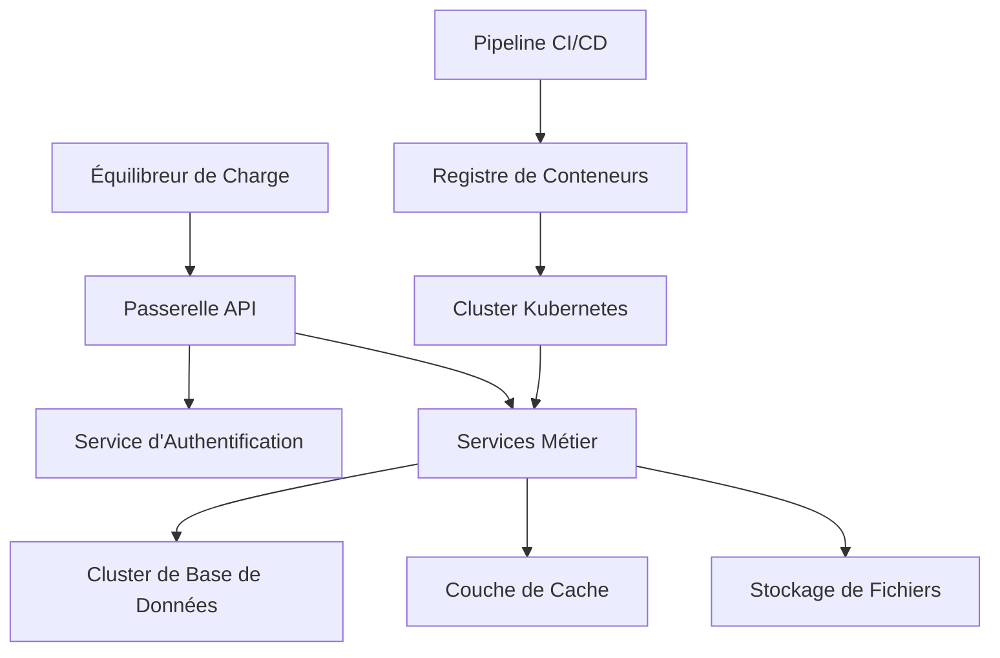

# Documentation Infrastructure

Cette section couvre la configuration de l'infrastructure, les processus de déploiement et les procédures opérationnelles pour tous les projets Optim.

## Aperçu

Notre infrastructure est conçue pour l'évolutivité, la fiabilité et la sécurité dans plusieurs environnements.

## Stratégie d'Environnement

### Types d'Environnements

| Environnement     | Objectif                     | Accès                     | Déploiement                  |
| ----------------- | ---------------------------- | ------------------------- | ---------------------------- |
| **Développement** | Développement local et tests | Tous les développeurs     | Manuel/automatique           |
| **Recette**       | Tests de pré-production      | Consultants, développeurs | Manuel                       |
| **Production**    | Système en direct            | Distributeurs, clients    | Approbation manuelle requise |

### Configuration des Environnements

```yaml
# environments.yml
development:
  api_url: "http://localhost:3000"
  database_url: "postgres://localhost:5432/optim_dev"
  redis_url: "redis://localhost:6379"
  log_level: "debug"

staging:
  api_url: "https://staging-api.optim.com"
  database_url: "${STAGING_DATABASE_URL}"
  redis_url: "${STAGING_REDIS_URL}"
  log_level: "info"

production:
  api_url: "https://api.optim.com"
  database_url: "${PRODUCTION_DATABASE_URL}"
  redis_url: "${PRODUCTION_REDIS_URL}"
  log_level: "warn"
```

## Architecture de Déploiement

### Architecture de Haut Niveau


```mermaid
graph TB
    A[Équilibreur de Charge] --> B[Passerelle API]
    B --> C[Service d'Authentification]
    B --> D[Services Métier]
    D --> E[Cluster de Base de Données]
    D --> F[Couche de Cache]
    D --> G[Stockage de Fichiers]
    H[Pipeline CI/CD] --> I[Registre de Conteneurs]
    I --> J[Cluster Kubernetes]
    J --> D
```

### Stack Technologique

**Orchestration de Conteneurs**

- Kubernetes (EKS/GKE)
- Conteneurs Docker
- Charts Helm pour le déploiement

**Bases de Données**

- PostgreSQL (base de données principale)
- Redis (cache et sessions)
- MongoDB (stockage de documents)

**Infrastructure**

- Fournisseurs cloud AWS/GCP
- Terraform pour l'infrastructure en tant que code
- CDN pour les ressources statiques

**Surveillance et Journalisation**

- Prometheus/Grafana pour les métriques
- Stack ELK pour la journalisation
- Sentry pour le suivi des erreurs

## Processus de Déploiement

### Pipeline CI/CD

```yaml
# .github/workflows/deploy.yml
name: Déployer
on:
  push:
    branches: [main, develop]
  pull_request:
    branches: [main]

jobs:
  test:
    runs-on: ubuntu-latest
    steps:
      - uses: actions/checkout@v3
      - name: Exécuter les tests
        run: |
          npm ci
          npm run test:coverage
          npm run lint

  build:
    needs: test
    runs-on: ubuntu-latest
    steps:
      - uses: actions/checkout@v3
      - name: Construire l'image Docker
        run: |
          docker build -t optim/app:${{ github.sha }} .
          docker push optim/app:${{ github.sha }}

  deploy-staging:
    needs: build
    if: github.ref == 'refs/heads/develop'
    runs-on: ubuntu-latest
    steps:
      - name: Déployer en staging
        run: |
          helm upgrade --install optim-app ./helm/optim-app \
            --set image.tag=${{ github.sha }} \
            --namespace staging

  deploy-production:
    needs: build
    if: github.ref == 'refs/heads/main'
    runs-on: ubuntu-latest
    environment: production
    steps:
      - name: Déployer en production
        run: |
          helm upgrade --install optim-app ./helm/optim-app \
            --set image.tag=${{ github.sha }} \
            --namespace production
```

### Étapes de Déploiement

1. **Fusion de Code** - Code fusionné vers la branche main/develop
2. **Tests Automatisés** - Tests unitaires et d'intégration exécutés
3. **Processus de Build** - Images Docker construites et étiquetées
4. **Scan de Sécurité** - Images de conteneurs scannées pour les vulnérabilités
5. **Déploiement Staging** - Déploiement automatique vers staging
6. **Approbation Production** - Approbation manuelle pour le déploiement en production
7. **Déploiement Production** - Déploiement avec stratégie blue-green
8. **Vérifications de Santé** - Vérification automatique de la santé
9. **Rollback** - Rollback automatique en cas d'échec

### Stratégie de Rollback

```bash
# Rollback rapide vers la version précédente
kubectl rollout undo deployment/optim-app -n production

# Rollback vers une révision spécifique
kubectl rollout undo deployment/optim-app --to-revision=3 -n production

# Vérifier le statut du rollout
kubectl rollout status deployment/optim-app -n production
```

## Infrastructure en tant que Code

### Configuration Terraform

```hcl
# main.tf
provider "aws" {
  region = var.aws_region
}

module "eks_cluster" {
  source = "./modules/eks"

  cluster_name = "optim-cluster"
  node_groups = {
    main = {
      instance_types = ["t3.medium"]
      min_size       = 2
      max_size       = 10
      desired_size   = 3
    }
  }
}

module "rds_database" {
  source = "./modules/rds"

  engine         = "postgres"
  engine_version = "13.7"
  instance_class = "db.t3.micro"
  allocated_storage = 20
}

module "elasticache" {
  source = "./modules/elasticache"

  engine           = "redis"
  node_type        = "cache.t3.micro"
  num_cache_nodes  = 1
}
```

### Manifestes Kubernetes

```yaml
# k8s/deployment.yml
apiVersion: apps/v1
kind: Deployment
metadata:
  name: optim-app
  namespace: production
spec:
  replicas: 3
  selector:
    matchLabels:
      app: optim-app
  template:
    metadata:
      labels:
        app: optim-app
    spec:
      containers:
        - name: app
          image: optim/app:latest
          ports:
            - containerPort: 3000
          env:
            - name: DATABASE_URL
              valueFrom:
                secretKeyRef:
                  name: database-secret
                  key: url
          resources:
            requests:
              memory: "256Mi"
              cpu: "250m"
            limits:
              memory: "512Mi"
              cpu: "500m"
          livenessProbe:
            httpGet:
              path: /health
              port: 3000
            initialDelaySeconds: 30
            periodSeconds: 10
          readinessProbe:
            httpGet:
              path: /ready
              port: 3000
            initialDelaySeconds: 5
            periodSeconds: 5
```

## Surveillance et Alertes

### Collecte de Métriques

```yaml
# prometheus/config.yml
global:
  scrape_interval: 15s

scrape_configs:
  - job_name: "optim-app"
    kubernetes_sd_configs:
      - role: pod
    relabel_configs:
      - source_labels: [__meta_kubernetes_pod_annotation_prometheus_io_scrape]
        action: keep
        regex: true
```

### Règles d'Alerte

```yaml
# alerts/app.yml
groups:
  - name: optim-app
    rules:
      - alert: TauxErreurEleve
        expr: rate(http_requests_total{status=~"5.."}[5m]) > 0.1
        for: 5m
        labels:
          severity: warning
        annotations:
          summary: "Taux d'erreur élevé détecté"
          description: "Le taux d'erreur est de {{ $value }} erreurs par seconde"

      - alert: UtilisationMemoireElevee
        expr: container_memory_usage_bytes / container_spec_memory_limit_bytes > 0.9
        for: 2m
        labels:
          severity: critical
        annotations:
          summary: "Utilisation mémoire élevée"
          description: "L'utilisation mémoire est supérieure à 90%"
```

### Tableaux de Bord

```json
{
  "dashboard": {
    "title": "Métriques Application Optim",
    "panels": [
      {
        "title": "Taux de Requêtes",
        "type": "graph",
        "targets": [
          {
            "expr": "rate(http_requests_total[5m])",
            "legendFormat": "{{method}} {{status}}"
          }
        ]
      },
      {
        "title": "Temps de Réponse",
        "type": "graph",
        "targets": [
          {
            "expr": "histogram_quantile(0.95, rate(http_request_duration_seconds_bucket[5m]))",
            "legendFormat": "95e percentile"
          }
        ]
      }
    ]
  }
}
```

## Sécurité

### Sécurité Réseau

```yaml
# k8s/network-policy.yml
apiVersion: networking.k8s.io/v1
kind: NetworkPolicy
metadata:
  name: optim-app-policy
  namespace: production
spec:
  podSelector:
    matchLabels:
      app: optim-app
  policyTypes:
    - Ingress
    - Egress
  ingress:
    - from:
        - podSelector:
            matchLabels:
              app: nginx-ingress
      ports:
        - protocol: TCP
          port: 3000
  egress:
    - to:
        - podSelector:
            matchLabels:
              app: postgres
      ports:
        - protocol: TCP
          port: 5432
```

### Gestion des Secrets

```yaml
# k8s/secrets.yml
apiVersion: v1
kind: Secret
metadata:
  name: database-secret
  namespace: production
type: Opaque
data:
  url: <url-base-de-donnees-encodee-base64>
  password: <mot-de-passe-encode-base64>
```

### Configuration SSL/TLS

```yaml
# k8s/ingress.yml
apiVersion: networking.k8s.io/v1
kind: Ingress
metadata:
  name: optim-app-ingress
  annotations:
    cert-manager.io/cluster-issuer: letsencrypt-prod
    nginx.ingress.kubernetes.io/ssl-redirect: "true"
spec:
  tls:
    - hosts:
        - api.optim.com
      secretName: optim-tls
  rules:
    - host: api.optim.com
      http:
        paths:
          - path: /
            pathType: Prefix
            backend:
              service:
                name: optim-app-service
                port:
                  number: 80
```

## Sauvegarde et Reprise après Sinistre

### Sauvegardes de Base de Données

```bash
#!/bin/bash
# scripts/backup-database.sh

# Sauvegarde quotidienne
pg_dump $DATABASE_URL | gzip > backups/$(date +%Y%m%d)-database.sql.gz

# Upload vers S3
aws s3 cp backups/$(date +%Y%m%d)-database.sql.gz s3://optim-backups/database/

# Nettoyage des anciennes sauvegardes (conserver 30 jours)
find backups/ -name "*.sql.gz" -mtime +30 -delete
```

### Plan de Reprise après Sinistre

1. **RTO (Objectif de Temps de Récupération)** : 4 heures
2. **RPO (Objectif de Point de Récupération)** : 1 heure
3. **Stratégie de Sauvegarde** : Sauvegardes quotidiennes de base de données, réplication de fichiers en temps réel
4. **Processus de Basculement** : Basculement DNS automatique vers la région secondaire

## Optimisation des Performances

### Stratégies de Mise à l'Échelle

```yaml
# k8s/hpa.yml
apiVersion: autoscaling/v2
kind: HorizontalPodAutoscaler
metadata:
  name: optim-app-hpa
spec:
  scaleTargetRef:
    apiVersion: apps/v1
    kind: Deployment
    name: optim-app
  minReplicas: 3
  maxReplicas: 20
  metrics:
    - type: Resource
      resource:
        name: cpu
        target:
          type: Utilization
          averageUtilization: 70
    - type: Resource
      resource:
        name: memory
        target:
          type: Utilization
          averageUtilization: 80
```

### Stratégie de Cache

```yaml
# Configuration Redis
apiVersion: v1
kind: ConfigMap
metadata:
  name: redis-config
data:
  redis.conf: |
    maxmemory 256mb
    maxmemory-policy allkeys-lru
    save 900 1
    save 300 10
    save 60 10000
```

## Snippets de Code pour Tâches Récurrentes

Cette section contient des extraits de code réutilisables pour les tâches d'infrastructure courantes et répétitives.

### Gestion des Deployments Kubernetes

#### Déploiement Rapide d'une Nouvelle Version

```bash
#!/bin/bash
# Déploiement rapide avec vérification de santé
APP_NAME=${1:-optim-app}
NAMESPACE=${2:-production}
IMAGE_TAG=${3:-latest}

echo "🚀 Déploiement de $APP_NAME:$IMAGE_TAG vers $NAMESPACE..."

# Mise à jour de l'image
kubectl set image deployment/$APP_NAME app=optim/$APP_NAME:$IMAGE_TAG -n $NAMESPACE

# Attendre que le rollout soit terminé
kubectl rollout status deployment/$APP_NAME -n $NAMESPACE --timeout=300s

# Vérifier la santé des pods
kubectl get pods -l app=$APP_NAME -n $NAMESPACE
```

#### Redimensionnement Rapide d'Application

```bash
#!/bin/bash
# Script de redimensionnement rapide
APP_NAME=${1:-optim-app}
REPLICAS=${2:-3}
NAMESPACE=${3:-production}

echo "📊 Redimensionnement de $APP_NAME à $REPLICAS répliques..."

kubectl scale deployment $APP_NAME --replicas=$REPLICAS -n $NAMESPACE
kubectl rollout status deployment/$APP_NAME -n $NAMESPACE
```

#### Redémarrage Forcé de Pods

```bash
#!/bin/bash
# Redémarrage complet des pods d'une application
APP_NAME=${1:-optim-app}
NAMESPACE=${2:-production}

echo "🔄 Redémarrage forcé de $APP_NAME..."

kubectl rollout restart deployment/$APP_NAME -n $NAMESPACE
kubectl rollout status deployment/$APP_NAME -n $NAMESPACE
```

### Gestion des Bases de Données

#### Sauvegarde Complète de Base de Données

```bash
#!/bin/bash
# Sauvegarde complète avec métadonnées
DB_NAME=${1:-optim_production}
TIMESTAMP=$(date +%Y%m%d_%H%M%S)
BACKUP_DIR="/backups"

echo "💾 Sauvegarde de $DB_NAME..."

# Créer le répertoire de sauvegarde
mkdir -p $BACKUP_DIR

# Sauvegarde avec compression
pg_dump $DATABASE_URL \
  --verbose \
  --clean \
  --no-acl \
  --no-owner \
  | gzip > $BACKUP_DIR/${DB_NAME}_${TIMESTAMP}.sql.gz

# Vérifier la sauvegarde
if [ $? -eq 0 ]; then
  echo "✅ Sauvegarde réussie: ${DB_NAME}_${TIMESTAMP}.sql.gz"

  # Upload vers S3
  aws s3 cp $BACKUP_DIR/${DB_NAME}_${TIMESTAMP}.sql.gz \
    s3://optim-backups/database/
else
  echo "❌ Échec de la sauvegarde"
  exit 1
fi
```

#### Restauration de Base de Données

```bash
#!/bin/bash
# Restauration sécurisée de base de données
BACKUP_FILE=${1}
TARGET_DB=${2:-optim_staging}

if [ -z "$BACKUP_FILE" ]; then
  echo "❌ Fichier de sauvegarde requis"
  echo "Usage: $0 <backup_file> [target_db]"
  exit 1
fi

echo "⚠️  ATTENTION: Restauration vers $TARGET_DB"
read -p "Êtes-vous sûr? (oui/non): " confirm

if [ "$confirm" = "oui" ]; then
  echo "🔄 Restauration en cours..."

  # Décompresser et restaurer
  gunzip -c $BACKUP_FILE | psql $TARGET_DATABASE_URL

  echo "✅ Restauration terminée"
else
  echo "❌ Restauration annulée"
fi
```

### Monitoring et Logs

#### Collection de Logs d'Urgence

```bash
#!/bin/bash
# Collecte rapide de logs pour debug
APP_NAME=${1:-optim-app}
NAMESPACE=${2:-production}
LINES=${3:-1000}
OUTPUT_DIR="/tmp/logs_$(date +%Y%m%d_%H%M%S)"

echo "📝 Collecte des logs de $APP_NAME..."

mkdir -p $OUTPUT_DIR

# Logs de tous les pods
for pod in $(kubectl get pods -l app=$APP_NAME -n $NAMESPACE -o name); do
  pod_name=$(basename $pod)
  echo "Collecte logs de $pod_name..."

  kubectl logs $pod_name -n $NAMESPACE --tail=$LINES \
    > $OUTPUT_DIR/${pod_name}.log

  # Logs du conteneur précédent si redémarrage
  kubectl logs $pod_name -n $NAMESPACE --previous --tail=$LINES \
    > $OUTPUT_DIR/${pod_name}_previous.log 2>/dev/null || true
done

# Événements Kubernetes
kubectl get events -n $NAMESPACE --sort-by='.lastTimestamp' \
  > $OUTPUT_DIR/k8s_events.log

echo "✅ Logs collectés dans: $OUTPUT_DIR"
tar -czf $OUTPUT_DIR.tar.gz -C /tmp $(basename $OUTPUT_DIR)
echo "📦 Archive créée: $OUTPUT_DIR.tar.gz"
```

#### Vérification de Santé Complète

```bash
#!/bin/bash
# Script de vérification de santé globale
NAMESPACE=${1:-production}

echo "🏥 Vérification de santé globale..."

# Statut des deployments
echo "=== DEPLOYMENTS ==="
kubectl get deployments -n $NAMESPACE -o wide

# Statut des pods
echo -e "\n=== PODS ==="
kubectl get pods -n $NAMESPACE -o wide

# Utilisation des ressources
echo -e "\n=== RESSOURCES ==="
kubectl top pods -n $NAMESPACE --sort-by=memory

# Services et endpoints
echo -e "\n=== SERVICES ==="
kubectl get services -n $NAMESPACE

# Événements récents
echo -e "\n=== ÉVÉNEMENTS RÉCENTS ==="
kubectl get events -n $NAMESPACE --sort-by='.lastTimestamp' | tail -10

# Alertes actives (si Prometheus)
echo -e "\n=== ALERTES ACTIVES ==="
curl -s http://prometheus:9090/api/v1/alerts | jq '.data.alerts[] | select(.state=="firing")' 2>/dev/null || echo "Prometheus non accessible"
```

### Maintenance et Nettoyage

#### Nettoyage d'Images Docker

```bash
#!/bin/bash
# Nettoyage des images Docker obsolètes
KEEP_DAYS=${1:-7}

echo "🧹 Nettoyage des images Docker (conserver $KEEP_DAYS jours)..."

# Supprimer les images non utilisées
docker image prune -a -f --filter "until=${KEEP_DAYS}*24h"

# Supprimer les volumes orphelins
docker volume prune -f

# Supprimer les réseaux inutilisés
docker network prune -f

# Supprimer les conteneurs arrêtés
docker container prune -f

echo "✅ Nettoyage terminé"
docker system df
```

#### Rotation des Secrets Kubernetes

```bash
#!/bin/bash
# Rotation de secret avec zero-downtime
SECRET_NAME=${1}
NAMESPACE=${2:-production}

if [ -z "$SECRET_NAME" ]; then
  echo "❌ Nom du secret requis"
  echo "Usage: $0 <secret_name> [namespace]"
  exit 1
fi

echo "🔐 Rotation du secret $SECRET_NAME..."

# Sauvegarder l'ancien secret
kubectl get secret $SECRET_NAME -n $NAMESPACE -o yaml > /tmp/${SECRET_NAME}_backup.yaml

# Générer nouveau mot de passe
NEW_PASSWORD=$(openssl rand -base64 32)

# Mettre à jour le secret
kubectl create secret generic $SECRET_NAME \
  --from-literal=password=$NEW_PASSWORD \
  --dry-run=client -o yaml | kubectl apply -n $NAMESPACE -f -

# Redémarrer les deployments qui utilisent ce secret
for deployment in $(kubectl get deployments -n $NAMESPACE -o json | jq -r '.items[] | select(.spec.template.spec.containers[].env[]?.valueFrom.secretKeyRef.name=="'$SECRET_NAME'") | .metadata.name'); do
  echo "Redémarrage de $deployment..."
  kubectl rollout restart deployment/$deployment -n $NAMESPACE
done

echo "✅ Rotation du secret terminée"
```

### Scripts d'Automatisation CI/CD

#### Validation Pré-Déploiement

```bash
#!/bin/bash
# Validation complète avant déploiement
APP_NAME=${1:-optim-app}
IMAGE_TAG=${2:-latest}

echo "🔍 Validation pré-déploiement pour $APP_NAME:$IMAGE_TAG..."

# 1. Vérifier que l'image existe
if ! docker manifest inspect optim/$APP_NAME:$IMAGE_TAG > /dev/null 2>&1; then
  echo "❌ Image optim/$APP_NAME:$IMAGE_TAG introuvable"
  exit 1
fi

# 2. Scanner la sécurité de l'image
echo "🔒 Scan de sécurité..."
trivy image optim/$APP_NAME:$IMAGE_TAG --severity HIGH,CRITICAL

# 3. Tester la configuration Kubernetes
echo "📋 Validation de la configuration K8s..."
helm template optim-app ./helm/optim-app \
  --set image.tag=$IMAGE_TAG \
  --validate

# 4. Vérifier les ressources disponibles
echo "📊 Vérification des ressources..."
kubectl top nodes

echo "✅ Validation terminée avec succès"
```

#### Post-Déploiement Health Check

```bash
#!/bin/bash
# Vérifications post-déploiement
APP_NAME=${1:-optim-app}
NAMESPACE=${2:-production}
HEALTH_ENDPOINT=${3:-/health}

echo "🩺 Vérifications post-déploiement..."

# Attendre que tous les pods soient prêts
kubectl wait --for=condition=ready pod -l app=$APP_NAME -n $NAMESPACE --timeout=300s

# Obtenir l'URL du service
SERVICE_URL=$(kubectl get service $APP_NAME-service -n $NAMESPACE -o jsonpath='{.status.loadBalancer.ingress[0].hostname}' 2>/dev/null)

if [ -z "$SERVICE_URL" ]; then
  # Fallback: port-forward temporaire
  kubectl port-forward service/$APP_NAME-service 8080:80 -n $NAMESPACE &
  PF_PID=$!
  SERVICE_URL="localhost:8080"
  sleep 5
fi

# Test de l'endpoint de santé
echo "🔗 Test de l'endpoint: http://$SERVICE_URL$HEALTH_ENDPOINT"
for i in {1..5}; do
  if curl -sf http://$SERVICE_URL$HEALTH_ENDPOINT > /dev/null; then
    echo "✅ Service opérationnel (tentative $i)"
    break
  else
    echo "⏳ Attente... (tentative $i/5)"
    sleep 10
  fi
done

# Nettoyer le port-forward
if [ ! -z "$PF_PID" ]; then
  kill $PF_PID 2>/dev/null
fi

# Vérifier les métriques
echo "📈 Vérification des métriques..."
kubectl get pods -l app=$APP_NAME -n $NAMESPACE
kubectl top pods -l app=$APP_NAME -n $NAMESPACE

echo "✅ Vérifications post-déploiement terminées"
```

## Dépannage

### Problèmes Courants

1. **Plantages de Pods**

   ```bash
   kubectl logs <nom-pod> -n production
   kubectl describe pod <nom-pod> -n production
   ```

2. **Utilisation Mémoire Élevée**

   ```bash
   kubectl top pods -n production
   kubectl exec -it <nom-pod> -- free -h
   ```

3. **Problèmes de Connexion Base de Données**
   ```bash
   kubectl exec -it <nom-pod> -- nc -zv postgres-service 5432
   ```

### Procédures d'Urgence

1. **Réduire le Trafic**

   ```bash
   kubectl scale deployment optim-app --replicas=1 -n production
   ```

2. **Activer le Mode Maintenance**

   ```bash
   kubectl apply -f k8s/maintenance-page.yml
   ```

3. **Accès d'Urgence à la Base de Données**
   ```bash
   kubectl port-forward service/postgres-service 5432:5432 -n production
   ```

## Ressources

- **[Documentation Kubernetes](https://kubernetes.io/docs/)**
- **[Documentation Terraform](https://www.terraform.io/docs/)**
- **[Documentation AWS EKS](https://docs.aws.amazon.com/eks/)**
- **[Documentation Prometheus](https://prometheus.io/docs/)**

---

_Pour les questions d'infrastructure ou les urgences, contactez immédiatement l'équipe DevOps._
