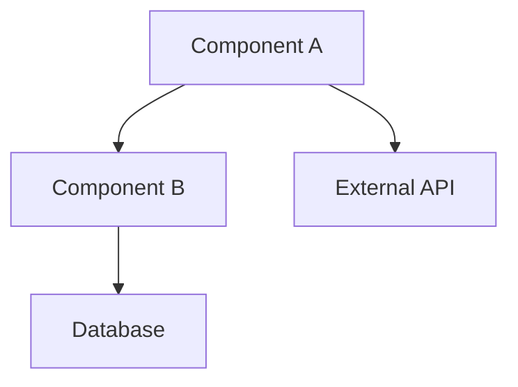

# Documentation Templates

This section provides standardized templates for creating consistent documentation across all Optim projects.

## Available Templates

### Project Documentation Templates

- **[New Project Template](#new-project-template)** - Complete project documentation structure
- **[API Documentation Template](#api-documentation-template)** - REST API documentation
- **[Feature Documentation Template](#feature-documentation-template)** - Individual feature documentation
- **[User Guide Template](#user-guide-template)** - End-user documentation

### Development Templates

- **[README Template](#readme-template)** - Project README files
- **[Changelog Template](#changelog-template)** - Version history documentation
- **[Contributing Guide Template](#contributing-guide-template)** - Contribution guidelines
- **[Troubleshooting Template](#troubleshooting-template)** - Problem resolution guides

## New Project Template

Use this structure when creating documentation for a new project:

```
project-name/
├── index.md                    # Project overview (use template below)
├── getting-started.md          # Quick start guide
├── user-guide/                 # End-user documentation
│   ├── index.md
│   ├── installation.md
│   ├── configuration.md
│   └── features/
├── development/                # Developer documentation
│   ├── index.md
│   ├── setup.md
│   ├── architecture.md
│   ├── contributing.md
│   └── testing.md
├── api/                        # API documentation (if applicable)
│   ├── index.md
│   ├── authentication.md
│   └── endpoints/
├── deployment/                 # Deployment and operations
│   ├── index.md
│   ├── environments.md
│   ├── deployment-guide.md
│   └── troubleshooting.md
├── reference/                  # Reference materials
│   ├── configuration.md
│   ├── commands.md
│   └── glossary.md
└── changelog.md               # Version history
```

### Project Index Template

````markdown
# Project Name

 

Brief description of what this project does and its main purpose.

## Overview

Detailed project description including:

- Main functionality
- Key features
- Target audience
- Technology stack

## Quick Links

- **[Getting Started](getting-started.md)** - Setup and installation
- **[User Guide](user-guide/index.md)** - How to use the application
- **[API Documentation](api/index.md)** - Technical API reference
- **[Development Guide](development/index.md)** - Developer information
- **[Deployment](deployment/index.md)** - Deployment procedures
- **[Changelog](changelog.md)** - Version history

## Key Features

### Feature 1

Description of feature 1

### Feature 2

Description of feature 2

### Feature 3

Description of feature 3

## Architecture


````

## Technology Stack

- **Frontend**: React, TypeScript, Tailwind CSS
- **Backend**: Node.js, Express, PostgreSQL
- **Infrastructure**: Docker, Kubernetes, AWS
- **Monitoring**: Prometheus, Grafana

## Getting Started

Quick start instructions:

1. Clone the repository
2. Install dependencies
3. Configure environment
4. Run the application

For detailed instructions, see [Getting Started](getting-started.md).

## Support

- **Documentation**: This documentation site
- **Issues**: [GitHub Issues](link-to-issues)
- **Contact**: [team-email@optim.com](mailto:team-email@optim.com)

---

_Project maintained by [Team Name]_

````

## API Documentation Template

```markdown
# API Documentation

## Overview

Brief description of the API, its purpose, and capabilities.

## Base URL

````

https://api.optim.com/v1

```

## Authentication

### API Key Authentication

Include your API key in the request header:

```

Authorization: Bearer YOUR_API_KEY

```

### OAuth 2.0

For user-specific operations, use OAuth 2.0:

```

Authorization: Bearer OAUTH_ACCESS_TOKEN

````

## Rate Limiting

- **Rate Limit**: 1000 requests per hour
- **Headers**:
  - `X-RateLimit-Limit`: Request limit per window
  - `X-RateLimit-Remaining`: Requests remaining in window
  - `X-RateLimit-Reset`: Window reset time

## Endpoints

### Users

#### Get User Profile

```http
GET /users/{id}
````

**Parameters:**

- `id` (required): User ID

**Response:**

```json
{
  "id": "user123",
  "name": "John Doe",
  "email": "john@example.com",
  "createdAt": "2023-01-01T00:00:00Z"
}
```

#### Create User

```http
POST /users
```

**Request Body:**

```json
{
  "name": "John Doe",
  "email": "john@example.com",
  "password": "securepassword"
}
```

**Response:**

```json
{
  "id": "user123",
  "name": "John Doe",
  "email": "john@example.com",
  "createdAt": "2023-01-01T00:00:00Z"
}
```

## Error Responses

All errors follow this format:

```json
{
  "error": {
    "code": "VALIDATION_ERROR",
    "message": "The request is invalid",
    "details": [
      {
        "field": "email",
        "message": "Email is required"
      }
    ]
  }
}
```

### Error Codes

| Code               | Description               |
| ------------------ | ------------------------- |
| `VALIDATION_ERROR` | Request validation failed |
| `UNAUTHORIZED`     | Authentication required   |
| `FORBIDDEN`        | Insufficient permissions  |
| `NOT_FOUND`        | Resource not found        |
| `RATE_LIMITED`     | Rate limit exceeded       |

## Examples

### cURL Examples

```bash
# Get user profile
curl -X GET "https://api.optim.com/v1/users/123" \
  -H "Authorization: Bearer YOUR_API_KEY"

# Create user
curl -X POST "https://api.optim.com/v1/users" \
  -H "Authorization: Bearer YOUR_API_KEY" \
  -H "Content-Type: application/json" \
  -d '{
    "name": "John Doe",
    "email": "john@example.com",
    "password": "securepassword"
  }'
```

### JavaScript Examples

```javascript
// Using fetch
const response = await fetch("https://api.optim.com/v1/users/123", {
  headers: {
    Authorization: "Bearer YOUR_API_KEY",
  },
});
const user = await response.json();

// Using axios
const user = await axios.get("https://api.optim.com/v1/users/123", {
  headers: {
    Authorization: "Bearer YOUR_API_KEY",
  },
});
```

## SDKs and Libraries

- **JavaScript/TypeScript**: [@optim/api-client](link)
- **Python**: [optim-api-python](link)
- **Go**: [optim-api-go](link)

## Changelog

See [API Changelog](api-changelog.md) for version history and breaking changes.

````

## Feature Documentation Template

```markdown
# Feature Name

## Overview

Brief description of the feature and its purpose.

## User Stories

- As a [user type], I want [goal] so that [benefit]
- As a [user type], I want [goal] so that [benefit]

## Requirements

### Functional Requirements
1. The system shall...
2. The user must be able to...
3. The feature should...

### Non-Functional Requirements
1. Performance: Response time < 2 seconds
2. Security: All data must be encrypted
3. Accessibility: WCAG 2.1 AA compliance

## Design

### User Interface


### User Flow

```mermaid
graph TD
    A[User lands on page] --> B{Is authenticated?}
    B -->|No| C[Redirect to login]
    B -->|Yes| D[Show feature]
    C --> E[User logs in]
    E --> D
    D --> F[User interacts with feature]
    F --> G[Feature response]
````

## Implementation

### Technical Approach

Brief explanation of how the feature is implemented.

### API Changes

New endpoints or modifications:

```http
POST /api/feature
GET /api/feature/{id}
PUT /api/feature/{id}
DELETE /api/feature/{id}
```

### Database Changes

```sql
-- New table for feature
CREATE TABLE feature_data (
    id UUID PRIMARY KEY,
    user_id UUID REFERENCES users(id),
    name VARCHAR(255) NOT NULL,
    created_at TIMESTAMP DEFAULT NOW()
);
```

## Testing

### Test Cases

1. **Happy Path**: User successfully uses feature
2. **Error Handling**: Invalid input handling
3. **Edge Cases**: Boundary conditions
4. **Security**: Permission and validation tests

### Acceptance Criteria

- [ ] User can access the feature from main navigation
- [ ] Feature responds within 2 seconds
- [ ] Error messages are user-friendly
- [ ] Feature works on mobile devices

## Configuration

### Environment Variables

```bash
FEATURE_ENABLED=true
FEATURE_API_ENDPOINT=https://api.example.com
FEATURE_TIMEOUT=5000
```

### Feature Flags

```javascript
{
  "feature_name": {
    "enabled": true,
    "rollout_percentage": 100,
    "user_groups": ["beta_users"]
  }
}
```

## Monitoring

### Metrics to Track

- Feature usage rate
- Error rate
- Response time
- User satisfaction

### Alerts

- Error rate > 5%
- Response time > 3 seconds
- Feature unavailable

## Documentation Links

- [User Guide](../user-guide/feature-name.md)
- [API Documentation](../api/feature-endpoints.md)
- [Troubleshooting](../troubleshooting/feature-issues.md)

## Known Issues

- Issue 1: Description and workaround
- Issue 2: Description and timeline for fix

## Future Enhancements

- Enhancement 1: Description and priority
- Enhancement 2: Description and priority

````

## README Template

```markdown
# Project Name

Brief description of the project.

## Table of Contents

- [Installation](#installation)
- [Usage](#usage)
- [API Documentation](#api-documentation)
- [Contributing](#contributing)
- [License](#license)

## Installation

### Prerequisites

- Node.js 16.0 or higher
- npm or yarn
- Database (PostgreSQL recommended)

### Setup

1. Clone the repository:
   ```bash
   git clone https://github.com/optim/project-name.git
   cd project-name
````

2. Install dependencies:

   ```bash
   npm install
   ```

3. Configure environment:

   ```bash
   cp .env.example .env
   # Edit .env with your configuration
   ```

4. Run database migrations:

   ```bash
   npm run migrate
   ```

5. Start the application:
   ```bash
   npm run dev
   ```

## Usage

### Basic Usage

```javascript
const client = new ProjectClient();
const result = await client.doSomething();
```

### Advanced Usage

```javascript
const client = new ProjectClient({
  apiKey: "your-api-key",
  timeout: 5000,
});

const result = await client.doSomethingAdvanced({
  option1: "value1",
  option2: "value2",
});
```

## Scripts

- `npm run dev` - Start development server
- `npm run build` - Build for production
- `npm run test` - Run tests
- `npm run lint` - Run linting

## API Documentation

For detailed API documentation, visit [API Docs](docs/api/index.md).

## Contributing

Please read [CONTRIBUTING.md](CONTRIBUTING.md) for details on our code of conduct and the process for submitting pull requests.

## License

This project is licensed under the MIT License - see the [LICENSE](LICENSE) file for details.

## Support

- Documentation: [docs.optim.com](https://docs.optim.com)
- Issues: [GitHub Issues](https://github.com/optim/project-name/issues)
- Email: [support@optim.com](mailto:support@optim.com)

````

## Changelog Template

```markdown
# Changelog

All notable changes to this project will be documented in this file.

The format is based on [Keep a Changelog](https://keepachangelog.com/en/1.0.0/),
and this project adheres to [Semantic Versioning](https://semver.org/spec/v2.0.0.html).

## [Unreleased]

### Added
- New features that have been added

### Changed
- Changes in existing functionality

### Deprecated
- Soon-to-be removed features

### Removed
- Features that have been removed

### Fixed
- Bug fixes

### Security
- Security-related changes

## [1.2.0] - 2023-12-01

### Added
- New user authentication system
- Dashboard with real-time metrics
- Export functionality for reports

### Changed
- Improved API response times by 50%
- Updated user interface design
- Enhanced error handling

### Fixed
- Fixed memory leak in background processes
- Resolved issue with file uploads
- Fixed broken navigation links

### Security
- Updated dependencies to latest versions
- Implemented rate limiting
- Added input sanitization

## [1.1.0] - 2023-11-01

### Added
- User profile management
- Email notifications
- Search functionality

### Fixed
- Fixed login redirect issue
- Resolved database connection timeout

## [1.0.0] - 2023-10-01

### Added
- Initial release
- Basic user management
- Core API functionality
- Documentation site

[unreleased]: https://github.com/optim/project/compare/v1.2.0...HEAD
[1.2.0]: https://github.com/optim/project/compare/v1.1.0...v1.2.0
[1.1.0]: https://github.com/optim/project/compare/v1.0.0...v1.1.0
[1.0.0]: https://github.com/optim/project/releases/tag/v1.0.0
````

## Usage Guidelines

### When to Use Templates

1. **Starting New Projects** - Use the complete project template structure
2. **Adding Features** - Use the feature documentation template
3. **Creating APIs** - Use the API documentation template
4. **Writing User Guides** - Adapt the user guide template

### Customization Guidelines

1. **Adapt to Project Needs** - Modify templates based on project requirements
2. **Maintain Consistency** - Keep the same structure across similar projects
3. **Update Templates** - Suggest improvements to templates based on experience
4. **Follow Standards** - Ensure templates align with organization standards

### Template Maintenance

- Templates are reviewed quarterly
- Feedback is collected from documentation authors
- Updates are communicated to all teams
- Version history is maintained for templates

---

_For questions about templates or suggestions for improvements, contact the Documentation Team._
